# Limbu AI — Final Technical Architecture Document

**Version:** 1.0 FINAL  
**Status:** Approved for development  
**Audience:** Engineering, DevOps, Security, Principal Engineers  
**Companion docs:** Product Blueprint FINAL v2.0, Development Execution Plan (Section 17)  
**Last updated:** June 2026

---

## Document Purpose

This document translates the Limbu product blueprint into an implementable technical architecture. It defines system topology, finalized technology choices, service boundaries, data flows, tenancy model, security controls, developer constraints, and module build order.

**Scope:** Marketing automation SaaS — Google Business Profile, Facebook, Instagram, reviews, AI content, scheduling, agency workflows.

**Architectural stance:** Modular monolith (API + workers + scheduler) with shared packages. Extract microservices only at 100K+ users. Optimize for shipping speed, type safety, and tenant isolation — not premature distribution.

---

## 1. System Architecture

### 1.1 Logical Architecture Overview

Limbu is a **multi-tenant B2B SaaS** composed of five runtime tiers:

1. **Client tier** — Next.js web app (+ React Native mobile in V2)
2. **Application tier** — NestJS modular monolith (API gateway + domain modules)
3. **Worker tier** — BullMQ processors + dedicated scheduler service
4. **AI tier** — Shared `ai-core` package (orchestrator, RAG, moderation, model router)
5. **Data tier** — PostgreSQL, Redis, Cloudflare R2, external APIs

```mermaid
flowchart TB
    subgraph clients [Client Tier]
        WebApp["Web App\n(Next.js 15)"]
        MobileApp["Mobile App\n(React Native / V2)"]
        PublicAPI["Public REST API\n(API Key Auth)"]
    end

    subgraph edge [Edge Tier]
        CDN["Cloudflare CDN"]
        WAF["WAF + DDoS"]
        LB["Load Balancer"]
    end

    subgraph application [Application Tier — NestJS Modular Monolith]
        Gateway["API Gateway Module"]
        AuthMod["Auth Module"]
        OrgMod["Organizations Module"]
        WorkspaceMod["Workspaces Module"]
        ContentMod["Content / Posts Module"]
        PublishMod["Publishing Module"]
        ReviewMod["Reviews Module"]
        ApprovalMod["Approvals Module"]
        BillingMod["Billing Module"]
        NotificationMod["Notifications Module"]
        WorkflowMod["Workflows Module"]
        ComplianceMod["Compliance Module"]
        IntegrationMod["Integrations Module"]
        AdminMod["Admin Module"]
    end

    subgraph workers [Worker Tier]
        WorkerProc["BullMQ Worker Process"]
        SchedulerSvc["Scheduler Service"]
        OutboxRelay["Outbox Relay Processor"]
    end

    subgraph ai [AI Tier — packages/ai-core]
        Orchestrator["AI Orchestrator"]
        RAGPipeline["RAG Pipeline"]
        PromptMgr["Prompt Manager"]
        ModelRouter["Model Router"]
        Moderation["Content Moderation"]
    end

    subgraph data [Data Tier]
        PG[("PostgreSQL 16\n+ pgvector")]
        Redis[("Redis 7")]
        R2[("Cloudflare R2")]
    end

    subgraph external [External Services]
        GoogleAPI["Google Business API"]
        MetaAPI["Meta Graph API"]
        StripeAPI["Stripe Billing"]
        OpenAI["OpenAI API"]
        Resend["Resend Email"]
        Sentry["Sentry"]
    end

    subgraph observability [Observability]
        OTel["OpenTelemetry"]
        Grafana["Grafana Cloud"]
        StatusPage["Better Uptime"]
    end

    WebApp --> CDN --> WAF --> LB --> Gateway
    MobileApp --> LB
    PublicAPI --> LB

    Gateway --> AuthMod
    Gateway --> OrgMod
    Gateway --> WorkspaceMod
    Gateway --> ContentMod
    Gateway --> PublishMod
    Gateway --> ReviewMod
    Gateway --> ApprovalMod
    Gateway --> BillingMod
    Gateway --> NotificationMod
    Gateway --> WorkflowMod
    Gateway --> ComplianceMod
    Gateway --> IntegrationMod
    Gateway --> AdminMod

    ContentMod --> Orchestrator
    ReviewMod --> Orchestrator
    WorkflowMod --> Orchestrator
    Orchestrator --> RAGPipeline
    Orchestrator --> PromptMgr
    Orchestrator --> ModelRouter
    Orchestrator --> Moderation
    ModelRouter --> OpenAI
    RAGPipeline --> PG

    PublishMod --> WorkerProc
    IntegrationMod --> WorkerProc
    WorkflowMod --> WorkerProc
    ComplianceMod --> WorkerProc
    SchedulerSvc --> Redis
    WorkerProc --> Redis
    OutboxRelay --> Redis

    WorkerProc --> GoogleAPI
    WorkerProc --> MetaAPI
    BillingMod --> StripeAPI
    NotificationMod --> Resend

    application --> PG
    application --> Redis
    workers --> PG
    ContentMod --> R2
    WorkerProc --> R2

    application --> OTel
    workers --> OTel
    OTel --> Grafana
    Gateway --> Sentry
    StatusPage --> Gateway
```

---

### 1.2 Component Specifications

#### Frontend

| Attribute | Decision |
|-----------|----------|
| Framework | Next.js 15 (App Router) |
| Language | TypeScript (strict) |
| UI | Tailwind CSS + shadcn/ui |
| State | React Server Components + TanStack Query (client mutations) |
| Auth session | HTTP-only cookies; no tokens in localStorage |
| Streaming | SSE for AI chat responses |
| Deployment | Vercel (edge CDN for static + SSR) |

**Responsibilities:** Marketing site, authenticated dashboard, onboarding, calendar, composer, reviews, approvals, billing UI, settings. The frontend is a **thin client** — all business rules live in the API.

---

#### Backend

| Attribute | Decision |
|-----------|----------|
| Framework | NestJS 10 (TypeScript) |
| Pattern | Modular monolith — one deployable, domain-separated modules |
| API style | REST JSON + SSE; OpenAPI 3.1 spec |
| Validation | Zod schemas shared via `packages/shared` |
| Deployment | Railway / Fly.io (containerized); 2+ instances behind LB |
| Process model | API process (stateless) + Worker process (queue consumers) + Scheduler process (cron) |

**Responsibilities:** Authentication, authorization, tenancy enforcement, domain logic, external API orchestration, webhook ingestion, job enqueueing, credit ledger, event outbox writes.

---

#### Database

| Attribute | Decision |
|-----------|----------|
| Engine | PostgreSQL 16 |
| Hosting | Neon PostgreSQL (production) — serverless, branching, auto-scale |
| Extensions | pgvector (embeddings), pg_trgm (FTS supplement) — enabled via `db:neon:extensions` |
| Pooling | Neon built-in pooler (`DATABASE_URL` pooled) + `DIRECT_URL` for migrations |
| Migrations | Prisma Migrate — versioned SQL migrations (+ supplementary SQL for indexes/RLS) |
| Defense | Row-Level Security (RLS) on all tenant tables |

**Responsibilities:** All relational data — users, orgs, workspaces, posts, reviews, billing, audit logs, event outbox, document metadata. Source of truth for all domain state.

---

#### Cache

| Attribute | Decision |
|-----------|----------|
| Engine | Redis 7 |
| Hosting | Upstash (MVP) → AWS ElastiCache (scale) |
| Uses | Session cache, rate limit counters, BullMQ backend, pub/sub events, prompt response cache, OAuth state tokens, distributed locks |

**Responsibilities:** Ephemeral and fast-access data only. Never the source of truth for domain state. TTL on all keys.

---

#### Vector Database

| Attribute | Decision |
|-----------|----------|
| MVP → V1 | pgvector extension in PostgreSQL |
| Scale (100K+) | Qdrant (managed cluster) |
| Embedding model | OpenAI `text-embedding-3-small` (1536 dimensions) |
| Index | HNSW on `document_chunks.embedding` |

**Responsibilities:** Semantic search over workspace knowledge base documents. Strict `workspace_id` filter on every query. No cross-tenant vector search.

---

#### Queue System

| Attribute | Decision |
|-----------|----------|
| Library | BullMQ 5 |
| Backend | Redis 7 |
| Queues (V1) | `publish`, `sync`, `ingest`, `workflow`, `outbox`, `compliance`, `notification` |
| Priority | `publish` (highest) > `sync` > `ingest` > `workflow` > others |
| Patterns | Delayed jobs, exponential backoff (3 retries), dead-letter queue per queue |

**Responsibilities:** All async work — publishing to GBP/Meta, review sync, document ingestion, workflow execution, outbox relay, GDPR purge, email dispatch.

---

#### AI Layer

| Attribute | Decision |
|-----------|----------|
| Package | `packages/ai-core` (shared library, not separate deployable in V1) |
| Primary provider | OpenAI (GPT-4o-mini default, GPT-4o premium, DALL-E 3 images) |
| Fallback | Anthropic Claude (circuit breaker failover) |
| Abstraction | `ModelRouter` interface — provider-agnostic |
| Moderation | OpenAI Moderation API + custom PII/profanity rules |

**Responsibilities:** Content generation, channel adaptation, review replies, chat, image generation, embeddings, RAG retrieval, moderation scanning, agent tool execution.

---

#### File Storage

| Attribute | Decision |
|-----------|----------|
| Provider | Cloudflare R2 (S3-compatible API) |
| SDK | AWS SDK v3 (`@aws-sdk/client-s3`) |
| Access | Private buckets; presigned URLs (15-min expiry) |
| CDN | Cloudflare CDN for published media (optional V2) |

**Responsibilities:** Post media, knowledge base documents, AI-generated images, GDPR export ZIPs, PDF reports. No user files on application servers.

---

#### Monitoring

| Attribute | Decision |
|-----------|----------|
| Errors | Sentry (web + API + workers) |
| Traces | OpenTelemetry → Grafana Cloud |
| Metrics | Prometheus-format SLIs: publish success rate, AI latency p95, queue depth, credit burn rate |
| Uptime | Better Uptime → status.limbu.ai |
| Logs | Structured JSON (Pino); `request_id`, `org_id`, `workspace_id` on every line |
| Alerting | Grafana alerts → PagerDuty (V1) |

**Responsibilities:** Error tracking, distributed tracing, SLI dashboards, incident detection, on-call paging.

---

### 1.3 Physical Deployment Architecture (Production)

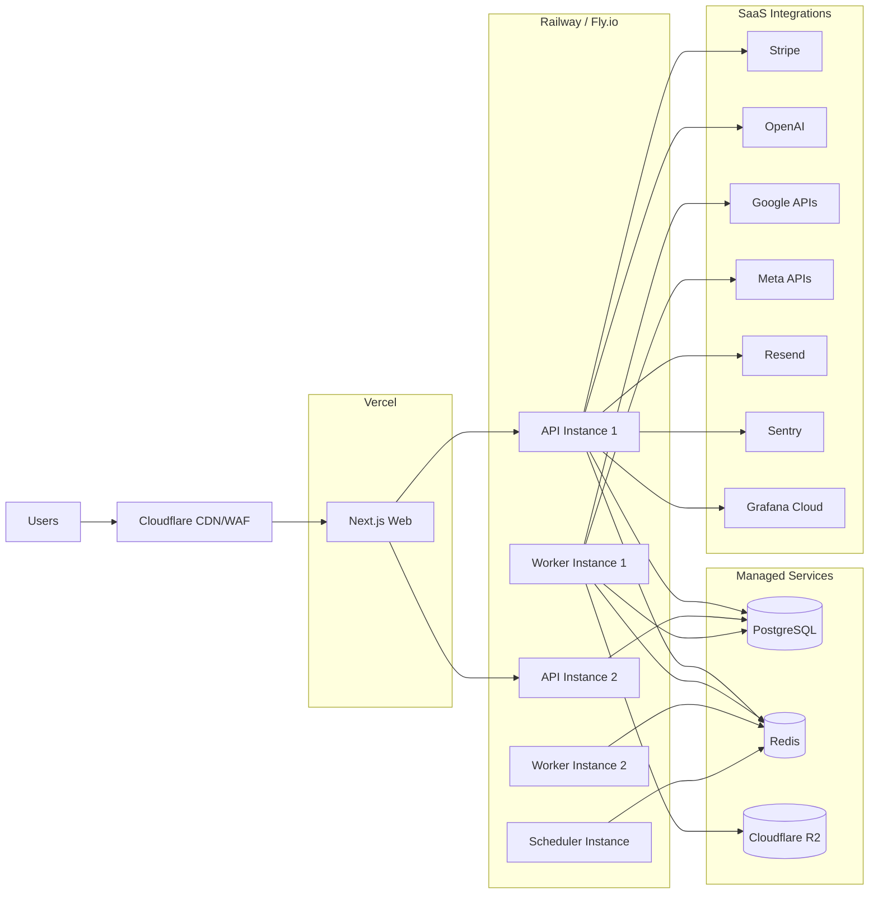

---

### 1.4 Monorepo Structure

```
limbu/
├── apps/
│   ├── web/           # Next.js 15 — frontend only
│   ├── api/           # NestJS — modular monolith
│   ├── worker/        # BullMQ processors
│   └── scheduler/     # Cron + Redis sorted set scheduler
├── packages/
│   ├── shared/        # Zod schemas, types, constants, event types
│   ├── db/            # Prisma schema, migrations, client, repositories
│   ├── ai-core/       # Orchestrator, RAG, prompts, moderation, model router
│   ├── email/         # React Email templates
│   ├── events/        # Event outbox helpers, event type definitions
│   └── config/        # Shared ESLint, TSConfig, Tailwind presets
├── infrastructure/
│   ├── docker/        # Local dev compose
│   ├── terraform/     # Production IaC (Phase 4+)
│   └── runbooks/      # Incident response
└── docs/
    ├── BLUEPRINT.md
    └── architecture/
        └── ARCHITECTURE.md   # This document
```

---

## 2. Tech Stack Finalization

### Final Stack Table

| Layer | Technology | Version |
|-------|------------|---------|
| **Frontend** | Next.js + React + TypeScript | 15.x / 19.x / 5.x |
| **Backend** | NestJS | 10.x |
| **Database** | PostgreSQL + pgvector | 16 |
| **ORM** | Prisma | 0.3x |
| **Authentication** | Custom (NestJS) + Arctic OAuth | — |
| **Vector DB** | pgvector (MVP) → Qdrant (scale) | — |
| **Cache** | Redis | 7 |
| **Queue** | BullMQ | 5.x |
| **Storage** | Cloudflare R2 | S3-compatible |
| **Monitoring** | Sentry + OpenTelemetry + Grafana Cloud + Better Uptime | — |
| **Billing** | Stripe Billing + Stripe Tax | — |

---

### Technology Decisions — WHY

#### Frontend: Next.js 15 + React + TypeScript

**Why chosen:**
- App Router enables React Server Components — reduces client bundle for dashboard pages that are mostly data display (calendar, review inbox, analytics)
- First-class SSE support for streaming AI responses
- Vercel deployment is zero-config with preview environments per PR
- Largest TypeScript/React hiring pool
- Marketing site and dashboard share one codebase and design system

**Why not alternatives:**
- *Remix* — smaller ecosystem, less RSC maturity
- *SPA (Vite + React)* — worse SEO for marketing, no RSC, more client-side complexity
- *Vue/Nuxt* — smaller pool, breaks monorepo type sharing with NestJS backend

---

#### Backend: NestJS (TypeScript)

**Why chosen:**
- Enforces modular architecture via modules, guards, interceptors, pipes — scales to 20+ domain modules without chaos
- Dependency injection makes service layer and repository pattern natural
- Guards map directly to RBAC requirements (org role + workspace role)
- OpenAPI generation from decorators
- Same language as frontend — shared Zod schemas and types in `packages/shared`
- BullMQ integrates cleanly as a NestJS-compatible worker process

**Why not alternatives:**
- *FastAPI (Python)* — splits language from frontend; better only if ML team owns AI (we use OpenAI API, not custom models)
- *tRPC-only* — no benefit for public REST API + mobile clients; couples frontend to backend
- *Go* — faster but slower team velocity; no type sharing with frontend

---

#### Database: PostgreSQL 16

**Why chosen:**
- ACID compliance for credit ledger, billing, approval workflows — non-negotiable
- Row-Level Security for multi-tenant defense-in-depth
- pgvector eliminates separate vector DB vendor at MVP
- JSONB for flexible post content (per-channel variants), workflow configs, audit metadata
- Mature ecosystem: PgBouncer, read replicas, Citus sharding path
- Full-text search sufficient for V1 (posts, reviews)

**Why not alternatives:**
- *MongoDB* — weak ACID for financial operations (credits, billing)
- *Supabase as BaaS* — couples us to Supabase auth/realtime; we need custom NestJS auth and workers
- *CockroachDB* — overkill at MVP; higher cost

---

#### ORM: Prisma

**Implementation choice** (`packages/db`):
- 78-model schema with 40 enums — validated and client-generated
- Versioned migrations via `prisma migrate` + `supplementary.sql` for partial indexes, HNSW, CHECK constraints
- Singleton client exported from `@limbu/db` for NestJS services

**Operational notes:**
- Use PgBouncer in **session mode** (or direct connections) — Prisma has known limitations in transaction-pooling mode
- Complex queries (pgvector similarity, analytics aggregations) use `$queryRaw` with typed results
- Repository pattern maps cleanly: one repository per aggregate root, all access through `@limbu/db`

**Alternatives considered:**
- *Drizzle ORM* — SQL-close, PgBouncer transaction-mode friendly; deferred in favor of Prisma's migration tooling and team familiarity
- *TypeORM* — decorator-heavy, weaker TypeScript inference

---

#### Authentication: Custom NestJS Auth + Arctic (OAuth)

**Why chosen:**
- Full control over session model (HTTP-only cookies, server-side `sessions` table)
- No per-MAU cost (Clerk/Auth0 becomes expensive at 10K+ users)
- Refresh token rotation with reuse detection — security requirement
- Arctic library handles OAuth 2.0 flows (Google, Apple, Meta) without vendor lock-in
- MFA (TOTP) added in V2 without vendor dependency
- Enterprise SSO (SAML/OIDC) via WorkOS added in Phase 6 as additive module

**Why not alternatives:**
- *Clerk* — fast MVP but $0.02+/MAU; org/workspace model doesn't map cleanly to our tenancy
- *Auth0* — expensive; over-featured for our needs
- *Supabase Auth* — couples auth to Supabase; limits custom session logic

---

#### Vector DB: pgvector (MVP) → Qdrant (100K+ users)

**Why chosen (pgvector):**
- Zero additional infrastructure at MVP
- Embeddings live alongside document metadata — transactional consistency on delete
- Sufficient performance up to ~500K chunks

**Why migrate to Qdrant:**
- Sub-100ms similarity search at millions of chunks
- Dedicated vector indexing without impacting OLTP PostgreSQL performance

---

#### Cache: Redis 7

**Why chosen:**
- Single solution for: BullMQ backend, rate limiting, session cache, pub/sub event bus, distributed locks, prompt cache
- Battle-tested delayed job support (BullMQ)
- Upstash serverless option for MVP (pay-per-request)

**Why not alternatives:**
- *Memcached* — no data structures, no pub/sub, no persistence option
- *SQS + Lambda* — higher latency for publish jobs; cold starts; more complex local dev

---

#### Queue: BullMQ 5

**Why chosen:**
- Redis-backed — reuses existing Redis infrastructure
- Delayed jobs for post scheduling (enqueue at `scheduled_at`)
- Priority queues, rate limiting, repeatable jobs (recurring posts)
- Dead-letter queue support
- Excellent TypeScript support; NestJS-compatible worker process

**Why not alternatives:**
- *Temporal* — powerful but high operational complexity; overkill for V1
- *AWS SQS* — no native delayed job precision; requires EventBridge for cron
- *RabbitMQ* — separate infrastructure; team has less experience

---

#### Storage: Cloudflare R2

**Why chosen:**
- S3-compatible API — standard SDK, easy migration to AWS S3 if needed
- Zero egress fees — critical for media-heavy app (images, documents, exports)
- Cloudflare CDN integration for future media delivery
- ~10x cheaper egress than AWS S3

**Why not alternatives:**
- *AWS S3* — egress costs scale painfully with media downloads
- *Supabase Storage* — couples to Supabase; less control over lifecycle policies

---

#### Monitoring: Sentry + OpenTelemetry + Grafana Cloud + Better Uptime

**Why chosen:**
- *Sentry* — best-in-class error tracking with release tracking and user context
- *OpenTelemetry* — vendor-neutral tracing; traces API → worker → external API calls
- *Grafana Cloud* — dashboards for SLIs (publish success rate, AI latency, queue depth); alerting
- *Better Uptime* — public status page (status.limbu.ai); subscriber notifications; required SaaS trust signal

**Why not alternatives:**
- *Datadog* — excellent but $$$ at early stage ($100+/mo minimum)
- *New Relic* — similar cost concerns

---

#### Billing: Stripe Billing + Stripe Tax

**Why chosen:**
- Industry standard for SaaS subscriptions
- Customer Portal for self-serve billing management
- Webhook-driven subscription sync — reliable
- Stripe Tax handles VAT/sales tax automatically (EU expansion requirement)
- Supports: subscriptions, trials, one-time credit packs, annual billing, dunning
- PCI SAQ-A scope (Stripe handles card data)

**Why not alternatives:**
- *Paddle* — merchant of record model; less control over billing UX
- *LemonSqueezy* — early-stage focus; less enterprise feature set

---

## 3. Service Boundaries

### 3.1 Boundary Principles

1. **Modules, not microservices** — All services below are NestJS modules or worker processors within the monorepo until 100K+ users
2. **No direct DB access across modules** — Modules communicate via service interfaces, not cross-module repository calls
3. **AI logic never in API controllers** — Controllers delegate to `ai-core` via service layer
4. **Workers are consumers, not decision-makers** — Workers execute jobs enqueued by API services; they do not initiate business decisions
5. **Shared packages for cross-cutting concerns** — `packages/db`, `packages/ai-core`, `packages/events`, `packages/shared`

---

### 3.2 Service Responsibility Matrix

#### Web App (`apps/web`)

| Owns | Does NOT Own |
|------|-------------|
| UI rendering and UX | Business logic |
| Form validation (client-side, Zod) | Authorization decisions |
| SSE consumer for AI streaming | Direct database access |
| TanStack Query cache | Direct external API calls |
| Cookie-based session forwarding | Credit deduction logic |
| Marketing site SEO | Tenant scoping |

**Integration point:** Calls `apps/api` REST endpoints exclusively. No Server Actions that touch DB directly (except health check routes).

---

#### API Layer (`apps/api` — NestJS Gateway + Domain Modules)

| Owns | Does NOT Own |
|------|-------------|
| HTTP routing and request validation | Long-running AI inference (delegates to ai-core) |
| Authentication and session management | Actual publish to GBP/Meta (enqueues job) |
| RBAC authorization (guards) | Document embedding (enqueues ingest job) |
| Tenancy context injection | Workflow step execution (enqueues workflow job) |
| Domain service orchestration | Scheduled job execution (delegates to scheduler) |
| Webhook ingestion (Stripe, inbound) | Vector search indexing |
| Job enqueueing to BullMQ | PDF generation |
| Event outbox writes (same TX as state change) | |
| OpenAPI spec generation | |

**Module map:**

```
api/
├── auth/           → sessions, OAuth, MFA, API keys
├── users/          → profile, preferences
├── organizations/  → org CRUD, members, invitations
├── workspaces/     → workspace CRUD, members, settings
├── integrations/   → OAuth flows, connection health, token refresh
├── posts/          → post CRUD, versions, calendar queries
├── publishing/     → schedule, enqueue publish jobs, status
├── approvals/      → approval policies, queue, decisions
├── reviews/        → inbox, AI reply, alert rules
├── ai/             → AI generation endpoints, chat threads
├── knowledge/      → document upload, KB management
├── workflows/      → workflow CRUD, activation
├── billing/        → Stripe sync, entitlements, dunning
├── notifications/  → in-app notifications, preferences
├── compliance/     → GDPR export, deletion, consent
├── analytics/      → dashboard metrics, post performance
├── search/         → full-text search
├── webhooks/       → outbound webhook config
└── admin/          → super admin, feature flags, impersonation
```

---

#### AI Service (`packages/ai-core` + `api/ai` module)

| Owns | Does NOT Own |
|------|-------------|
| AI Orchestrator — request routing and execution | HTTP transport (API module handles) |
| Model Router — provider selection and failover | Credit balance storage (Credit Ledger Service) |
| Prompt Manager — template loading and variable injection | User authentication |
| Content Moderation — pre/post generation scanning | Document storage (RAG Service) |
| Streaming response generation (SSE chunks) | Publishing to external platforms |
| Token counting and cost calculation | Workflow trigger evaluation |
| Agent tool execution planner | |
| Output schema validation (JSON mode) | |

**Public interface (TypeScript):**

```
AiOrchestrator.generate(request: AiRequest): AsyncGenerator<AiChunk>
AiOrchestrator.generateStructured<T>(request: AiRequest, schema: ZodSchema<T>): T
ModelRouter.selectModel(task: AiTaskType, plan: PlanTier): ModelConfig
ModerationService.scan(content: string): ModerationResult
PromptManager.build(task: AiTaskType, context: PromptContext): string
```

---

#### RAG Service (`packages/ai-core/rag` + `api/knowledge` module + ingest worker)

| Owns | Does NOT Own |
|------|-------------|
| Document text extraction (PDF, DOCX, TXT) | File upload HTTP handling (API/knowledge module) |
| Chunking strategy (512 tokens, 50 overlap) | AI content generation (AI Service) |
| Embedding generation (OpenAI batch) | User-facing chat UI (Web App) |
| Vector storage and indexing (pgvector) | Authentication |
| Similarity search with workspace filter | |
| Reranking (optional, V2) | |
| Prompt injection sanitization of retrieved chunks | |
| Re-ingestion on document update | |

**Public interface:**

```
RagService.ingest(documentId: string): void          // enqueues job
RagService.retrieve(workspaceId: string, query: string, topK: number): Chunk[]
RagService.deleteDocument(documentId: string): void   // removes chunks
```

---

#### Workflow Service (`api/workflows` module + workflow worker)

| Owns | Does NOT Own |
|------|-------------|
| Workflow CRUD and activation | AI content generation (calls AI Service) |
| Trigger registration on event bus | Publishing (calls Publishing Service) |
| Condition evaluation | Email sending (calls Notification Service) |
| Step sequencing and execution | Event generation (reads from outbox relay) |
| Workflow run logging | |
| Test mode (dry-run with sample event) | |

**Trigger sources:** `event_outbox` relay → Redis pub/sub → Workflow Service consumer

**Action delegates:**
- `generate_content` → AI Service
- `publish_post` → Publishing Service (enqueue)
- `send_notification` → Notification Service
- `webhook_outbound` → Webhook Delivery Service
- `create_approval` → Approval Service

---

#### Billing Service (`api/billing` module + Stripe webhooks)

| Owns | Does NOT Own |
|------|-------------|
| Stripe customer lifecycle | AI credit deduction (Credit Ledger Service) |
| Subscription sync from Stripe webhooks | Plan feature UI (Web App) |
| Plan entitlements enforcement | Usage recording (AI Service → Credit Ledger) |
| Dunning state machine (day 0/3/7/14) | |
| Trial management | |
| Stripe Tax configuration | |
| Invoice history sync | |
| Annual billing and credit pack purchases | |

**Integration:** Stripe is the source of truth for payment state. `subscriptions` table is a sync cache. Never compute billing state from local data alone — always reconcile with Stripe.

---

#### Notification Service (`api/notifications` module + notification worker)

| Owns | Does NOT Own |
|------|-------------|
| In-app notification creation and delivery | Business event detection (domain services emit events) |
| Email dispatch via Resend | Email template design (packages/email) |
| Notification preference enforcement | |
| Push notification dispatch (V2) | |
| Slack/Teams webhook dispatch (V2) | |
| Delivery logging (`email_deliveries`) | |

**Does NOT send notifications synchronously in API request path.** All email/push dispatch is async via `notification` queue.

---

### 3.3 Service Interaction Diagram

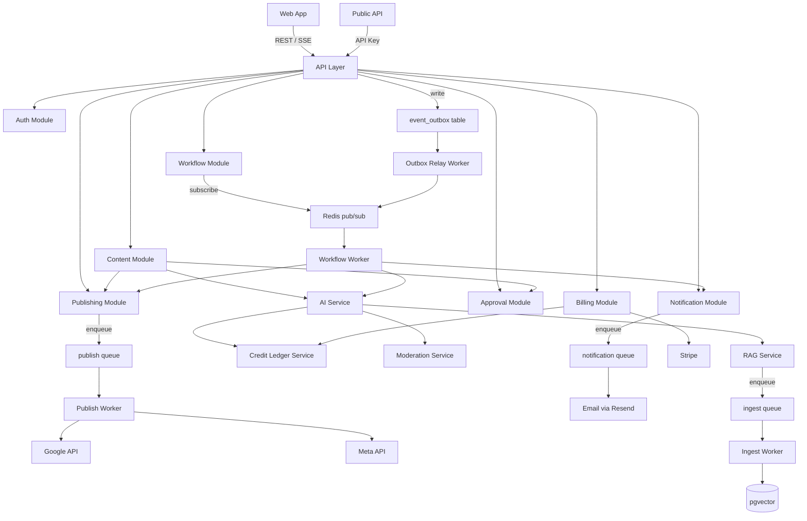

---

## 4. Data Flow

### 4.1 AI Request Flow — Complete Path

This diagram shows the end-to-end flow when a user sends a message in the AI chat assistant or requests content generation.

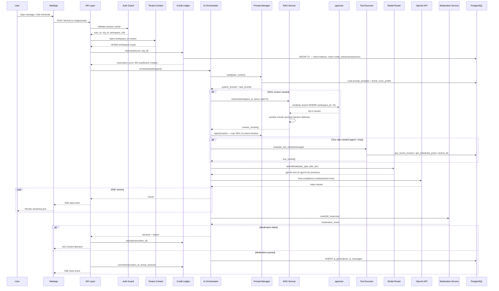

---

### 4.2 AI Orchestrator Internal Flow

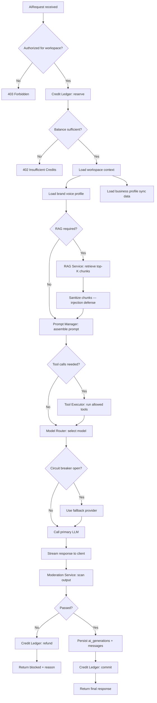

---

### 4.3 Publish Flow (Scheduled Post)

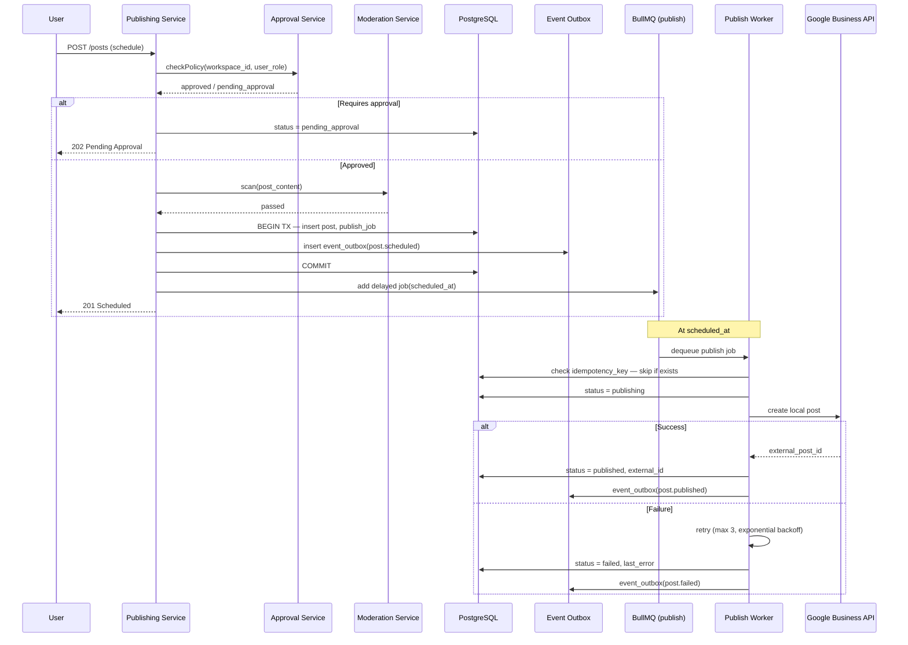

---

### 4.4 RAG Ingestion Flow

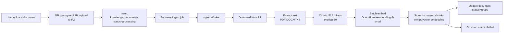

---

## 5. Multi-Tenant Strategy

### 5.1 Tenancy Model

Limbu uses a **shared database, shared schema** model with two isolation levels:

```
Organization (billing boundary)
  └── Workspace (data boundary)
        └── All domain data (posts, reviews, AI, KB, workflows)
```

| Level | ID Column | Isolation Scope |
|-------|-----------|-----------------|
| **Organization** | `organization_id` | Billing, credits, subscriptions, org members, API keys, audit logs |
| **Workspace** | `workspace_id` | Posts, reviews, integrations, AI threads, knowledge base, workflows |

---

### 5.2 Organization Isolation

**Rules:**
- Every org-scoped table has `organization_id NOT NULL`
- JWT contains `org_id` and `org_role`
- API guard validates user's `organization_members` row before any org operation
- Billing, credits, and subscriptions are org-scoped — never workspace-scoped
- Cross-org queries are structurally impossible: repository layer always injects `org_id` from tenant context
- PostgreSQL RLS policy: `organization_id = current_setting('app.org_id')`

**Org-scoped tables:** `organizations`, `organization_members`, `subscriptions`, `credit_balances`, `credit_transactions`, `ai_usage_records`, `api_keys`, `webhook_endpoints`, `audit_logs`, `invoices`, `dunning_events`

---

### 5.3 Workspace Isolation

**Rules:**
- Every workspace-scoped table has `workspace_id NOT NULL`
- JWT contains `workspace_ids[]` with roles (or active `workspace_id` in session)
- API guard validates `workspace_members` row for the requested workspace
- All AI operations, RAG retrieval, posts, reviews are workspace-scoped
- Vector search always includes `WHERE workspace_id = $1` — no exceptions
- PostgreSQL RLS policy: `workspace_id = current_setting('app.workspace_id')`

**Workspace-scoped tables:** `workspaces`, `workspace_members`, `integration_connections`, `posts`, `reviews`, `ai_threads`, `knowledge_documents`, `document_chunks`, `workflows`, `brand_voice_profiles`

---

### 5.4 Data Ownership Model

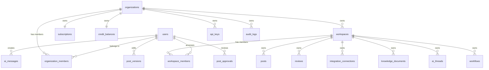

**Ownership rules:**
- **Organization owns** billing, credits, plan limits, API keys, webhooks, audit logs
- **Workspace owns** all marketing data: posts, reviews, integrations, KB, workflows, brand voice
- **User creates** content (posts, AI messages) but does not own it — workspace owns it
- **User deletion** triggers GDPR purge across all orgs/workspaces they belong to
- **Workspace archive** soft-deletes workspace; data retained per plan retention policy
- **Org deletion** cascades to all workspaces after 30-day grace period

---

### 5.5 Tenant Context Propagation

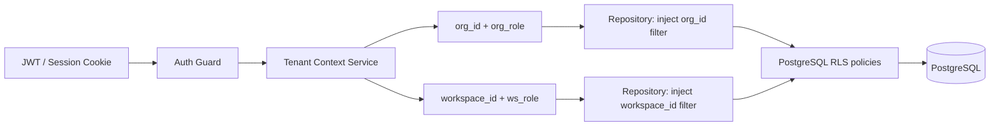

**Tenant context is set once per request** in the Auth Guard and propagated via NestJS `AsyncLocalStorage` — never passed as method parameters through the call stack.

---

### 5.6 Cross-Tenant Isolation Testing

Required CI test suite (`tenant-isolation-tests.yml`):

| Test | Expected Result |
|------|-----------------|
| User A requests User B's post by ID | 403 or 404 |
| User A lists posts with User B's workspace_id | 403 |
| User A RAG query returns User B's document chunks | Empty result |
| User A API key accesses User B's org endpoint | 403 |
| Admin impersonation accesses data without audit log | Test fails |
| Repository query without tenant context | Test fails (throws) |

**Rule:** 100% pass required to merge to `main`. No exceptions.

---

## 6. Security Architecture

### 6.1 Security Architecture Overview

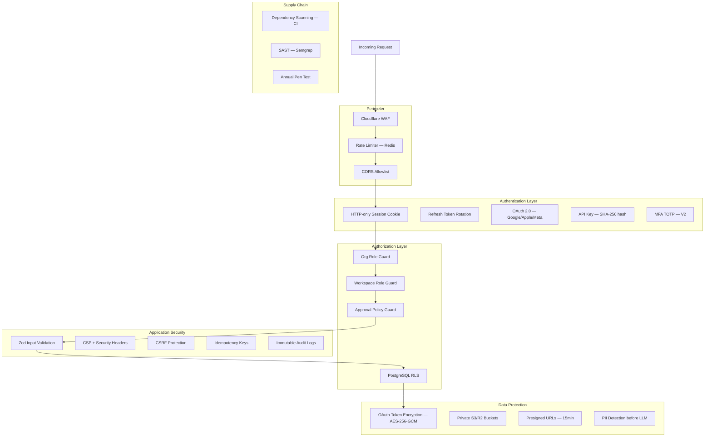

---

### 6.2 Authentication

| Mechanism | Implementation |
|-----------|---------------|
| Session | HTTP-only, Secure, SameSite=Lax cookie; `sessions` table; 24h expiry |
| Refresh token | HTTP-only cookie; rotation on every use; reuse detection revokes all sessions |
| Email/password | bcrypt cost factor 12; min 12 chars; HaveIBeenPwned check |
| Google OAuth | Arctic OAuth 2.0; state CSRF token in `oauth_states` |
| Apple OAuth | Arctic OAuth 2.0 |
| API keys | `limbu_sk_` prefix; SHA-256 hash stored; scopes enforced; rotatable |
| MFA (V2) | TOTP via `otplib`; required for Enterprise |
| Brute force | 5 failed attempts → 15-min lockout → CAPTCHA challenge |

**Rule:** No JWT in localStorage. No Bearer tokens in frontend JavaScript.

---

### 6.3 RBAC

Two-level RBAC enforced at NestJS Guard level:

**Org roles:** `owner` > `admin` > `member` > `billing`

**Workspace roles:** `admin` > `approver` > `editor` > `viewer`

```typescript
// Guard decorator usage pattern (conceptual — not actual code)
@RequireOrgRole('admin')
@RequireWorkspaceRole('editor')
@RequireApprovalPolicy('can_submit')
```

**Approval policy guard** is a third authorization layer — checks `approval_policies` table before allowing post state transitions.

---

### 6.4 API Security

| Control | Implementation |
|---------|---------------|
| Rate limiting | Redis sliding window per IP + per user + per API key |
| Rate limits | Free: 100 req/min; Pro: 1000 req/min; Enterprise: custom |
| AI endpoints | Additional per-org daily cap (3x plan credit value in USD) |
| Input validation | Zod schema on every request body, query, and params |
| CORS | Allowlist: `limbu.ai`, `app.limbu.ai`, `localhost:3000` |
| CSRF | Double-submit cookie on all cookie-authenticated mutations |
| Idempotency | `Idempotency-Key` header on POST/PUT; 24h TTL in Redis |
| Webhook verification | Stripe signature, Meta HMAC, Google JWT verification |
| Outbound webhooks | HMAC-SHA256 signed with endpoint secret |
| Security headers | HSTS, CSP, X-Frame-Options: DENY, X-Content-Type-Options: nosniff |
| Error responses | Never expose stack traces; generic 500 message |

---

### 6.5 Rate Limiting Architecture

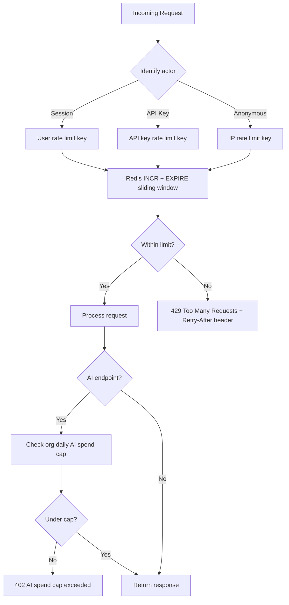

---

### 6.6 Secrets Management

| Secret | Storage | Rotation |
|--------|---------|----------|
| OAuth client secrets | Environment variables (Railway/Fly secrets) | On provider rotation |
| OAuth user tokens | `integration_credentials` — AES-256-GCM encrypted | Auto-refresh; manual re-auth on failure |
| Encryption key (KMS) | AWS KMS or environment `ENCRYPTION_KEY` | Annual |
| API key hashes | `api_keys.key_hash` — SHA-256 | User-initiated rotation |
| Stripe webhook secret | Environment variable | On Stripe dashboard rotation |
| Webhook endpoint secrets | `webhook_endpoints.secret_hash` — SHA-256 | User-initiated rotation |
| OpenAI API key | Environment variable | Quarterly |
| Database credentials | Managed service (Supabase/RDS) | Managed by provider |

**Rules:**
- No secrets in source code or git history
- No secrets in logs (structured log scrubber removes known patterns)
- OAuth tokens never returned in API responses
- Encryption key never stored in database

---

## 7. Development Constraints

All engineers must follow these architectural rules. Violations are PR blockers.

### 7.1 Layering Rules

| Rule | Description |
|------|-------------|
| **DC-01** | No business logic in UI components. React components render state and dispatch actions only. |
| **DC-02** | No direct database access from `apps/web`. All data via REST API. |
| **DC-03** | No direct external API calls from `apps/web` (no OpenAI, Stripe, Google from browser). |
| **DC-04** | All database access goes through the Repository layer in `packages/db`. No raw SQL in services or controllers. |
| **DC-05** | Service layer contains all business logic. Controllers are thin: validate → call service → return response. |
| **DC-06** | Workers contain execution logic only. Business decisions are made in services before enqueueing. |
| **DC-07** | `packages/ai-core` is provider-agnostic. No OpenAI imports outside `ai-core/providers/`. |
| **DC-08** | All async side effects (email, publish, ingest, workflow) go through BullMQ. No fire-and-forget `setTimeout` in API. |

---

### 7.2 Data Access Rules

| Rule | Description |
|------|-------------|
| **DC-09** | Every repository query on tenant data must include `organization_id` or `workspace_id` filter from tenant context. |
| **DC-10** | Repository methods throw if tenant context is not set (no implicit global queries). |
| **DC-11** | All write operations that emit domain events must write to `event_outbox` in the same database transaction. |
| **DC-12** | Credit operations use Credit Ledger Service only. No direct `credit_balances` updates outside ledger. |
| **DC-13** | OAuth tokens are read/written only through `IntegrationCredentialsRepository` with encryption/decryption. |
| **DC-14** | Soft delete by default (`deleted_at`). Hard delete only via Compliance Worker after grace period. |
| **DC-15** | All migrations are forward-only. No destructive migrations without backup confirmation. |

---

### 7.3 API Design Rules

| Rule | Description |
|------|-------------|
| **DC-16** | All request bodies validated with Zod schemas from `packages/shared`. |
| **DC-17** | All API responses use consistent envelope: `{ data, meta, error }`. |
| **DC-18** | All mutations on non-idempotent endpoints require `Idempotency-Key` header. |
| **DC-19** | Error responses never expose internal details. Use error codes: `INSUFFICIENT_CREDITS`, `CONTENT_BLOCKED`, `APPROVAL_REQUIRED`. |
| **DC-20** | All endpoints documented in OpenAPI spec. Spec updated in same PR as endpoint change. |
| **DC-21** | Pagination uses cursor-based pagination (not offset) for all list endpoints. |
| **DC-22** | SSE endpoints set `Content-Type: text/event-stream` and `Cache-Control: no-cache`. |

---

### 7.4 AI Development Rules

| Rule | Description |
|------|-------------|
| **DC-23** | All AI calls go through `AiOrchestrator`. No direct OpenAI client calls in domain modules. |
| **DC-24** | Credits are reserved before LLM call, committed after success, refunded on failure. No exceptions. |
| **DC-25** | All AI outputs pass through `ModerationService` before being returned or auto-published. |
| **DC-26** | RAG retrieval always filters by `workspace_id`. Test this in tenant isolation suite. |
| **DC-27** | Retrieved RAG chunks are sanitized before prompt injection. Max 30% of context window from RAG. |
| **DC-28** | Prompt templates are versioned in `prompt_templates` table. Changes require new version row. |
| **DC-29** | All AI generations persisted in `ai_generations` for audit and dispute resolution. |
| **DC-30** | Agent tools that mutate state (publish, auto-reply) require explicit policy check, never auto-execute. |

---

### 7.5 Security Rules

| Rule | Description |
|------|-------------|
| **DC-31** | No secrets in code, logs, or error responses. |
| **DC-32** | All new endpoints require auth guard unless explicitly public (health, webhook, marketing). |
| **DC-33** | Cross-tenant access attempts return 404 (not 403) to prevent resource enumeration. |
| **DC-34** | Admin impersonation requires MFA + reason + audit log entry before session created. |
| **DC-35** | All file uploads validated: MIME type, max size, virus scan before processing. |
| **DC-36** | Dependency PRs with critical CVEs are blocked by CI. No `--no-verify` on security checks. |
| **DC-37** | PII (email, phone) detected in AI inputs is redacted before sending to LLM. |

---

### 7.6 Frontend Rules

| Rule | Description |
|------|-------------|
| **DC-38** | Server Actions used only for: form submissions to API, revalidation, simple redirects. No DB access. |
| **DC-39** | TanStack Query for all client-side data fetching and mutations. Consistent cache key pattern: `['resource', workspaceId, ...params]`. |
| **DC-40** | Workspace context (active workspace) stored in URL or session — not global React state. |
| **DC-41** | Optimistic updates only for non-critical actions (mark notification read). Never for publish or billing. |
| **DC-42** | All user-facing error messages mapped from API error codes. No raw error objects displayed. |
| **DC-43** | i18n keys used for all user-facing strings (next-intl). No hardcoded strings in components. |

---

### 7.7 Testing Rules

| Rule | Description |
|------|-------------|
| **DC-44** | Unit tests required for all service layer methods. |
| **DC-45** | Integration tests required for all repository methods with real PostgreSQL (test container). |
| **DC-46** | Tenant isolation tests required for every new workspace-scoped endpoint. |
| **DC-47** | Worker processors must have tests with mocked external APIs. |
| **DC-48** | Credit ledger operations must have concurrency tests (parallel reserve/commit). |
| **DC-49** | No PR merged to `main` with failing tenant isolation tests. |

---

### 7.8 Architecture Pattern Summary

```
Controller → Service → Repository → Database
                ↓
            AiOrchestrator (ai-core)
                ↓
            BullMQ Queue → Worker Processor
                ↓
            External API (Google, Meta, OpenAI, Stripe)
```

**Never:**
```
Controller → Database (bypass service/repository)
Controller → OpenAI (bypass ai-core)
Service → setTimeout (bypass queue)
Web App → Database (bypass API)
Web App → OpenAI (bypass API + ai-core)
```

---

## 8. Final Build Order

Modules are ordered by dependency. **Do not start a module until its dependencies are complete.**

Complexity: **XS** (hours) · **S** (0.5–1 day) · **M** (2–3 days) · **L** (4–8 days) · **XL** (1–2 weeks)

---

### Phase 0 — Pre-Development (Week 0)

| Module | Goal | Dependencies | Complexity |
|--------|------|--------------|------------|
| **M0.1** External account provisioning | Stripe, Google Cloud, Meta, OpenAI, R2, Resend, Sentry accounts live | None | M |
| **M0.2** Legal documents | ToS, Privacy Policy, Cookie Policy drafted and published | None | L (legal) |
| **M0.3** Design system + Figma | Core screens designed; design tokens defined | None | XL |
| **M0.4** OAuth app review submission | Google + Meta apps submitted for review | M0.1, M0.2 | L |

---

### Phase 1 — Foundation (Weeks 1–6)

| Module | Goal | Dependencies | Complexity |
|--------|------|--------------|------------|
| **M1.1** Monorepo scaffold | Turborepo, all apps/packages bootstrapped; CI green | None | M |
| **M1.2** Local dev environment | Docker Compose: PG, Redis, MinIO, Mailpit | M1.1 | M |
| **M1.3** Database schema — identity | Core tables, Prisma migrations, seed script, RLS stubs | M1.2 | L |
| **M1.4** Staging deployment | Web + API + worker deployed to staging | M1.1, M0.1 | M |
| **M1.5** Authentication | Email/password, Google OAuth, sessions, refresh rotation, brute-force lockout | M1.3 | XL |
| **M1.6** Post-signup provisioning | Auto-create org + workspace + trial + legal acceptance | M1.5, M0.2 | M |
| **M1.7** Organizations & workspaces | Org/workspace CRUD, RBAC guards, tenant context | M1.6 | L |
| **M1.8** Dashboard shell | Authenticated layout, sidebar nav, workspace header | M1.7 | L |
| **M1.9** Secrets/KMS service | OAuth token encryption (AES-256-GCM) | M1.3 | M |
| **M1.10** Google Business Profile OAuth | OAuth flow, location selection, token refresh | M1.9, M0.1 | XL |
| **M1.11** AI Orchestrator core | `packages/ai-core`: model router, prompt manager, OpenAI client, SSE streaming | M1.1, M0.1 | XL |
| **M1.12** Content moderation | OpenAI Moderation + custom rules; block before publish | M1.11 | M |
| **M1.13** AI content generation | GBP post generation, multi-channel adaptation, composer UI | M1.11, M1.12 | XL |
| **M1.14** Credit ledger | Atomic reserve/commit/refund; plan entitlements seed | M1.3 | L |
| **M1.15** Posts & calendar | Post CRUD, composer UI, calendar UI, post statuses | M1.7, M1.13 | XL |
| **M1.16** Scheduler service | Delayed jobs, timezone-aware scheduling, Redis sorted sets | M1.15, M1.2 | L |
| **M1.17** Publish worker (GBP) | Idempotent publish, retry, circuit breaker, DLQ | M1.10, M1.16, M1.12 | XL |
| **M1.18** Stripe billing | Checkout, webhooks, subscription sync, trial, plan limits | M1.7, M0.1 | XL |
| **M1.19** Compliance basics | ToS acceptance, deletion request, status page | M1.5, M0.2 | M |
| **M1.20** Observability | Sentry, structured logging, request correlation IDs | M1.4 | M |

**Phase 1 exit criteria:** User signs up → connects GBP → generates AI post → schedules → publishes to GBP. Stripe billing live. Status page live.

---

### Phase 2 — Multi-Channel & Reviews (Weeks 7–10)

| Module | Goal | Dependencies | Complexity |
|--------|------|--------------|------------|
| **M2.1** Meta OAuth (FB + IG) | Facebook Page + Instagram Business connection | M1.9, M0.4 | L |
| **M2.2** Publish worker (FB + IG) | Extend publish processor for Meta Graph API | M2.1, M1.17 | L |
| **M2.3** Multi-channel composer | Channel-specific previews and validation | M2.2, M1.15 | L |
| **M2.4** Review sync worker | GBP review pull every 15 min; dedup; sync run logging | M1.10 | L |
| **M2.5** Review inbox UI | List, filter, reply status | M2.4 | M |
| **M2.6** AI review reply | Generate + moderate + publish reply to GBP | M1.11, M2.4 | L |
| **M2.7** Negative review alerts | 1–2 star immediate email + in-app alert | M2.4, M2.8 | M |
| **M2.8** Notification service | In-app notifications + email dispatch (async) | M1.3 | L |
| **M2.9** Onboarding wizard | 5-step guided flow; activation event | M1.10, M1.13, M1.15 | L |
| **M2.10** Dashboard KPIs | Posts, rating, unreplied reviews, upcoming | M2.4, M1.15 | M |
| **M2.11** Integration health dashboard | Connection status, token expiry, reconnect | M1.10, M2.1 | M |
| **M2.12** Dunning stage 1 | Payment failed → email + banner | M1.18 | M |

**Phase 2 exit criteria:** MVP complete. Meta publishing live. Review inbox + AI replies. Onboarding wizard. First 100 beta users.

---

### Phase 3 — Agency, RAG & Team Plan (Weeks 11–15)

| Module | Goal | Dependencies | Complexity |
|--------|------|--------------|------------|
| **M3.1** Multi-workspace support | Multiple workspaces per org; plan limit enforcement | M1.18 | M |
| **M3.2** Workspace switcher + roles | Switcher UI; admin/editor/approver/viewer roles | M3.1 | L |
| **M3.3** Approval workflow | Policies, queue, approve/reject, notifications | M3.2, M1.15 | XL |
| **M3.4** Brand voice profiles | CRUD + AI prompt injection | M1.11 | M |
| **M3.5** Content templates | Template library + apply in composer | M1.13 | M |
| **M3.6** Knowledge base upload | Document upload to R2; presigned URLs; validation | M1.2 | M |
| **M3.7** RAG ingestion pipeline | Extract → chunk → embed → pgvector store | M3.6, M1.11 | XL |
| **M3.8** RAG in AI generation | Retrieve chunks; sanitize; inject into prompts | M3.7 | L |
| **M3.9** Business profile sync | GBP hours/phone/categories → workspace metadata | M1.10 | M |
| **M3.10** Team plan (Stripe) | Team tier products; 15 workspaces; 2000 credits | M1.18 | M |
| **M3.11** Usage dashboard | Credits, posts, workspaces, members usage | M1.14, M3.1 | M |
| **M3.12** Post version history | Version on edit; view diff; restore | M1.15 | M |
| **M3.13** Public API + API keys | Scoped keys; read endpoints; OpenAPI spec | M3.2 | L |
| **M3.14** Event outbox | Transactional outbox + relay worker | M1.15 | L |
| **M3.15** Audit logging | Sensitive action logging; org owner view | M1.7 | M |
| **M3.16** Tenant isolation test suite | CI cross-tenant leak tests; PR blocker | M3.2 | L |

**Phase 3 exit criteria:** Agency model live. Approval queue. RAG knowledge base. Team plan. Isolation tests green.

---

### Phase 4 — Automation, Analytics & V1 Launch (Weeks 16–20)

| Module | Goal | Dependencies | Complexity |
|--------|------|--------------|------------|
| **M4.1** Workflow engine | Trigger evaluation, step execution, run logging | M3.14 | XL |
| **M4.2** Workflow builder UI | Visual builder; test mode; activate | M4.1 | XL |
| **M4.3** Recurring post rules | Cron-based post generation from templates | M1.16, M3.5 | L |
| **M4.4** Auto-reply rules | 4–5 star auto-reply; 1–3 star hold for human | M2.6, M3.3 | L |
| **M4.5** GBP insights sync | Pull views/searches/actions; analytics_snapshots | M1.10 | L |
| **M4.6** Post performance analytics | Per-post impressions/engagement; sync worker | M4.5, M2.2 | L |
| **M4.7** Analytics dashboard UI | Charts, date range, CSV export | M4.5, M4.6 | L |
| **M4.8** Media library + processing | Upload, resize, compress, virus scan | M1.2 | L |
| **M4.9** Full-text search | PostgreSQL FTS; search API + command palette UI | M1.15, M2.4 | M |
| **M4.10** Full dunning flow | Day 0/3/7/14; read-only mode; cancel | M2.12 | L |
| **M4.11** Stripe Customer Portal + Tax | Self-serve billing; VAT for EU | M1.18 | M |
| **M4.12** GDPR data export | Self-serve ZIP export; compliance worker | M1.19 | L |
| **M4.13** Compliance purge worker | Full account deletion across DB, R2, vectors | M1.19, M3.7 | L |
| **M4.14** Security hardening | CSP, security headers, dependency scanning | M1.4 | M |
| **M4.15** Load testing | k6: 500 concurrent users; publish SLA verified | M1.17, M1.11 | L |
| **M4.16** Penetration test | External pen test; remediate critical/high | M4.14, M3.16 | L |
| **M4.17** Marketing site + docs | Landing, pricing, docs.limbu.ai, help center | M0.3 | L |
| **M4.18** OpenTelemetry + Grafana | SLI dashboards; alerting; PagerDuty | M1.20 | L |
| **M4.19** Super admin panel | Org search, feature flags, AI cost per org | M1.14 | L |
| **M4.20** V1 launch checklist | All gates verified; rollback tested | All Phase 4 | M |

**Phase 4 exit criteria:** V1 public launch. Workflows live. Analytics dashboard. Security audit passed. GDPR complete.

---

### Phase 5 — V2 Growth (Weeks 21–28)

| Module | Goal | Dependencies | Complexity |
|--------|------|--------------|------------|
| **M5.1** AI image generation | DALL-E 3 integration; media library save | M1.11, M4.8 | L |
| **M5.2** AI in-app chat assistant | Threads, SSE streaming, RAG context | M1.11, M3.8 | L |
| **M5.3** AI agents | Scheduled autonomous tasks; tool execution; run logs | M4.1, M1.11 | XL |
| **M5.4** GBP Q&A inbox | Q&A sync, AI answer, publish | M1.10, M1.11 | L |
| **M5.5** Message inbox | GBP/Meta DMs unified inbox | M2.1 | L |
| **M5.6** PDF client reports | Monthly PDF; email delivery; agency branding | M4.7 | L |
| **M5.7** Outbound webhooks | Signed delivery; retry; delivery logs | M3.14 | L |
| **M5.8** Zapier integration | Zapier app; triggers + actions | M5.7 | L |
| **M5.9** UTM builder + smart scheduling | UTM tracking; AI time recommendations | M1.15, M4.6 | M |
| **M5.10** Mobile apps (iOS + Android) | React Native; calendar, notifications, approve | M1.8, M3.3 | XL |
| **M5.11** MFA + annual billing + Slack | TOTP MFA; annual plan; Slack notifications | M1.5, M1.18 | L |

---

### Phase 6 — Enterprise & Scale (Weeks 29–40)

| Module | Goal | Dependencies | Complexity |
|--------|------|--------------|------------|
| **M6.1** SSO (SAML/OIDC) | WorkOS integration; IdP group → role mapping | M1.5 | XL |
| **M6.2** SOC 2 Type I | Audit; controls documented; gaps remediated | M3.15, M4.16 | XL |
| **M6.3** Qdrant migration | Migrate vectors from pgvector; < 100ms search | M3.7 | XL |
| **M6.4** Read replicas + PgBouncer | Read scaling; connection pooling | M4.15 | L |
| **M6.5** Queue separation + fair-queue | Per-job-type queues; per-org concurrency caps | M1.17 | L |
| **M6.6** EU data residency | EU region PG + R2; tenant region routing | M1.4 | XL |
| **M6.7** White-label reports | Agency logo/colors on PDF reports | M5.6 | M |
| **M6.8** Keyword tracking | Local SEO keyword rankings | M4.5 | L |
| **M6.9** Referral program | Referral links; credit rewards | M1.18 | M |
| **M6.10** i18n (Hindi + Spanish) | next-intl; full UI translation | M1.8 | XL |

---

### 8.1 Build Order Dependency Graph

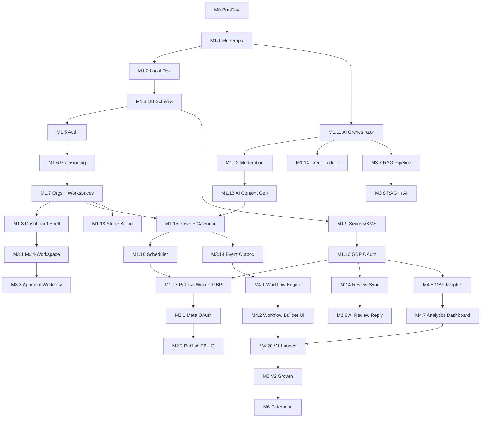

---

### 8.2 Module Count Summary

| Phase | Modules | Est. Weeks | Team |
|-------|---------|------------|------|
| Phase 0 | 4 | 2 (parallel) | PM + Legal + Design |
| Phase 1 | 20 | 6 | 2 BE + 1 FE + 1 Design |
| Phase 2 | 12 | 4 | 2 BE + 1 FE + 1 Design |
| Phase 3 | 16 | 5 | 2 BE + 1 FE + 1 Design |
| Phase 4 | 20 | 5 | 2 BE + 1 FE + 1 Infra |
| Phase 5 | 11 | 8 | 2 BE + 1 FE + 1 Mobile |
| Phase 6 | 10 | 12 | 2 BE + 1 Infra + 1 Compliance |
| **Total** | **93** | **~42** | |

---

### 8.3 V1 Launch Gates

All modules M0–M4 must be complete. Additionally:

| Gate | Owner | Required |
|------|-------|----------|
| Penetration test passed (no critical/high open) | Security | Yes |
| Load test passed (500 concurrent, publish SLA) | Infra | Yes |
| Tenant isolation tests 100% green | Backend | Yes |
| Legal documents live (ToS, Privacy, Cookie) | Legal | Yes |
| Status page live (status.limbu.ai) | Infra | Yes |
| Stripe live mode configured | Backend | Yes |
| Google + Meta OAuth apps approved | Backend | Yes |
| Runbooks documented (5 scenarios) | Infra | Yes |
| Rollback procedure tested | Infra | Yes |
| GDPR export + deletion verified | Backend | Yes |

---

*End of Limbu AI Final Technical Architecture Document v1.0*
