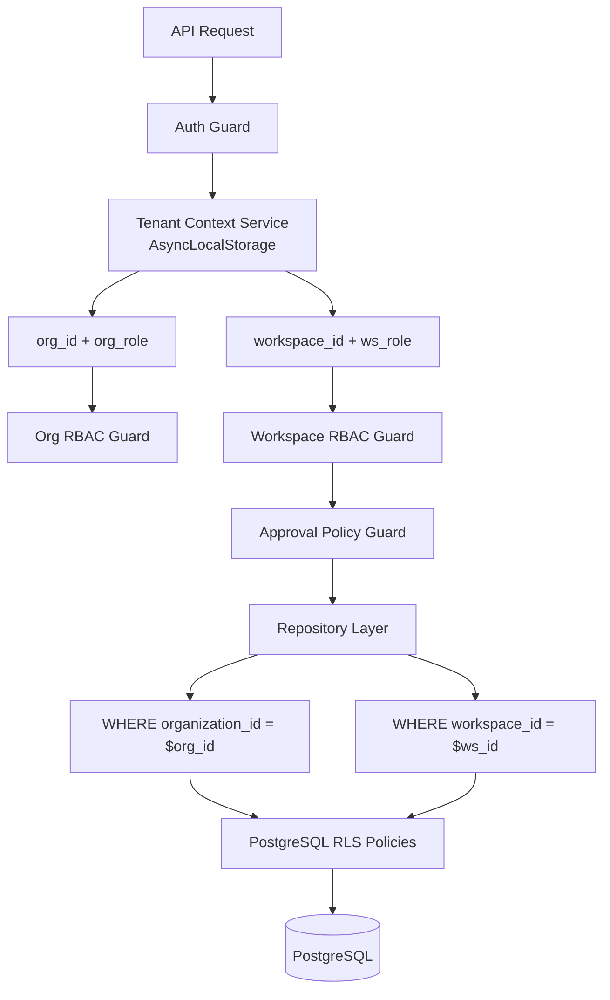

# Limbu AI — Final Database Design Document

**Version:** 1.0 FINAL  
**Status:** Approved for implementation planning  
**Database:** PostgreSQL 16 + pgvector  
**ORM:** Drizzle ORM (schema implementation deferred)  
**Audience:** Backend engineers, DBAs, security reviewers  
**Companion docs:** [ARCHITECTURE.md](./ARCHITECTURE.md), Product Blueprint FINAL v2.0  
**Last updated:** June 2026

---

## Document Purpose

This document defines the **complete logical data model** for Limbu before any schema code or migrations are written. It covers entity discovery, ownership, relationships, isolation, scaling, and a critical review of risks and gaps.

**Design principles:**
1. Shared database, shared schema — `organization_id` and `workspace_id` on all tenant data
2. PostgreSQL is the single source of truth for domain state
3. Redis is never authoritative — cache and queues only
4. R2/S3 stores blobs; PostgreSQL stores metadata and references (`s3_key`)
5. Embeddings live in `document_chunks` (pgvector) until Qdrant migration at scale
6. Roles are **enums**, not separate `roles`/`permissions` tables (RBAC is two-level: org role + workspace role)

---

## Phase 1: Entity Discovery

Entities are grouped by domain. **67 tables** across 14 domains.

**Owner key:**
- **Platform** — global, no tenant
- **User** — belongs to a person
- **Organization** — billing and admin boundary
- **Workspace** — marketing data boundary
- **System** — internal ops, no user owner

---

### Domain 1: Identity & Authentication (9 entities)

#### `users`
| Attribute | Value |
|-----------|-------|
| **Purpose** | Core identity for every person using Limbu. Stores profile, auth method, locale, MFA flag. |
| **Owner** | User (self) |
| **Relationships** | 1:N → sessions, refresh_tokens, organization_members, workspace_members, ai_threads, notifications, user_acceptances, consent_records |
| **Lifecycle** | `active` → `soft_deleted` (deleted_at) → hard purge via Compliance Worker after 30-day grace |

#### `sessions`
| Attribute | Value |
|-----------|-------|
| **Purpose** | Server-side session records for HTTP-only cookie auth. Enables logout, session invalidation, audit. |
| **Owner** | User |
| **Relationships** | N:1 → users |
| **Lifecycle** | Created on login → `active` until expires_at or explicit logout → deleted |

#### `refresh_tokens`
| Attribute | Value |
|-----------|-------|
| **Purpose** | Refresh token rotation chain. Reuse detection revokes entire chain on token theft. |
| **Owner** | User |
| **Relationships** | N:1 → users; optional self-ref → rotated_from |
| **Lifecycle** | Issued on login → rotated on refresh (old marked used) → revoked on logout/password change/reuse detection |

#### `password_reset_tokens`
| Attribute | Value |
|-----------|-------|
| **Purpose** | Single-use tokens for password reset email flow. |
| **Owner** | User |
| **Relationships** | N:1 → users |
| **Lifecycle** | Created on reset request → `pending` → `used` or `expired` (1h TTL) → deleted |

#### `mfa_secrets`
| Attribute | Value |
|-----------|-------|
| **Purpose** | TOTP secrets for MFA (V2). Encrypted at rest. |
| **Owner** | User |
| **Relationships** | 1:1 → users |
| **Lifecycle** | Created on MFA setup → `active` → revoked on MFA disable |

#### `oauth_states`
| Attribute | Value |
|-----------|-------|
| **Purpose** | CSRF state tokens for OAuth initiation flows (Google, Apple, Meta). Short-lived. |
| **Owner** | User (initiator) |
| **Relationships** | N:1 → users |
| **Lifecycle** | Created on OAuth start → `pending` → `consumed` or `expired` (10 min) → deleted |

#### `api_keys`
| Attribute | Value |
|-----------|-------|
| **Purpose** | Scoped API keys for public REST API access. Only hash stored, never plaintext. |
| **Owner** | Organization |
| **Relationships** | N:1 → organizations; used by integrators on behalf of org |
| **Lifecycle** | `active` → `revoked` or `expired` → soft deleted |

#### `impersonation_sessions`
| Attribute | Value |
|-----------|-------|
| **Purpose** | Audited super-admin impersonation sessions for support debugging. |
| **Owner** | Platform (System) |
| **Relationships** | N:1 → users (admin_id); N:1 → users (target_user_id) |
| **Lifecycle** | Created with reason → `active` (max 30 min) → `ended` → immutable record retained |

#### `onboarding_progress`
| Attribute | Value |
|-----------|-------|
| **Purpose** | Persists onboarding wizard step and partial data so users can resume. |
| **Owner** | User + Organization (composite context) |
| **Relationships** | N:1 → users; N:1 → organizations |
| **Lifecycle** | Created on signup → steps advanced → `completed` on wizard finish → archived after 90 days |

---

### Domain 2: Tenancy & Access Control (7 entities)

#### `organizations`
| Attribute | Value |
|-----------|-------|
| **Purpose** | Top-level tenant. Billing boundary, credit pool, subscription anchor, team membership. |
| **Owner** | Organization (self) — `owner_id` references founding user |
| **Relationships** | 1:N → workspaces, organization_members, api_keys, subscriptions, credit_balances, audit_logs; 1:1 → subscriptions (active), credit_balances |
| **Lifecycle** | `active` → `suspended` (dunning day 7) → `cancelled` → `pending_deletion` (30-day grace) → purged |

#### `organization_members`
| Attribute | Value |
|-----------|-------|
| **Purpose** | Many-to-many join: users ↔ organizations with org-level role. |
| **Owner** | Organization |
| **Relationships** | N:1 → organizations; N:1 → users; role enum: owner, admin, member, billing |
| **Lifecycle** | `active` → `removed` (soft) → purged on org deletion |

**Design note:** Roles are stored as enum on this join table. There is no separate `roles` or `permissions` table. Permission matrix is enforced in application guards, not DB lookups.

#### `workspaces`
| Attribute | Value |
|-----------|-------|
| **Purpose** | Sub-tenant unit. One workspace = one client location or one agency client account. All marketing data lives here. |
| **Owner** | Organization |
| **Relationships** | N:1 → organizations; 1:N → posts, reviews, integrations, ai_threads, knowledge_documents, workflows, agents; 1:1 → approval_policies, brand_voice_profiles |
| **Lifecycle** | `active` → `archived` (soft) → hard deleted on org purge or explicit delete after retention period |

#### `workspace_members`
| Attribute | Value |
|-----------|-------|
| **Purpose** | Many-to-many join: users ↔ workspaces with workspace-level role. |
| **Owner** | Organization (via workspace) |
| **Relationships** | N:1 → workspaces; N:1 → users; role enum: admin, approver, editor, viewer |
| **Lifecycle** | `active` → `removed` → purged with workspace |

#### `invitations`
| Attribute | Value |
|-----------|-------|
| **Purpose** | Pending email invitations to join org and/or specific workspaces. |
| **Owner** | Organization |
| **Relationships** | N:1 → organizations; optional workspace_ids[] in payload |
| **Lifecycle** | `pending` → `accepted` / `expired` / `revoked` (7-day TTL) |

#### `approval_policies`
| Attribute | Value |
|-----------|-------|
| **Purpose** | Per-workspace rule: whether posts require approval before scheduling. |
| **Owner** | Workspace |
| **Relationships** | 1:1 → workspaces |
| **Lifecycle** | Created with workspace → updated by WS admin → deleted with workspace |

#### `business_profiles`
| Attribute | Value |
|-----------|-------|
| **Purpose** | Synced GBP business metadata (hours, phone, address, categories, website). Used as AI context. |
| **Owner** | Workspace |
| **Relationships** | 1:1 → workspaces; synced from `connected_locations` / GBP API |
| **Lifecycle** | Created on first GBP sync → refreshed daily by Sync Worker → deleted with workspace |

---

### Domain 3: Integrations (4 entities)

#### `integration_connections`
| Attribute | Value |
|-----------|-------|
| **Purpose** | A connected external account (GBP, Facebook Page, Instagram) per workspace. |
| **Owner** | Workspace |
| **Relationships** | N:1 → workspaces; 1:1 → integration_credentials; 1:N → connected_locations, integration_sync_runs |
| **Lifecycle** | `pending` → `active` → `expired` (token failure) → `disconnected` (user action) → deleted with workspace |

#### `integration_credentials`
| Attribute | Value |
|-----------|-------|
| **Purpose** | Encrypted OAuth access/refresh tokens. Separated from connection metadata for security isolation. |
| **Owner** | Workspace (via connection) |
| **Relationships** | 1:1 → integration_connections |
| **Lifecycle** | Created on OAuth callback → tokens refreshed by worker → revoked on disconnect or GDPR purge |

#### `connected_locations`
| Attribute | Value |
|-----------|-------|
| **Purpose** | Specific GBP location or FB/IG account linked to a connection. |
| **Owner** | Workspace (via connection) |
| **Relationships** | N:1 → integration_connections |
| **Lifecycle** | Selected during OAuth → updated on sync → removed on disconnect |

#### `integration_sync_runs`
| Attribute | Value |
|-----------|-------|
| **Purpose** | Audit log of each sync job execution (reviews, insights, messages, Q&A). |
| **Owner** | Workspace (via connection) |
| **Relationships** | N:1 → integration_connections |
| **Lifecycle** | Created per job run → `running` → `success` / `failed` → retained 90 days → archived |

---

### Domain 4: Content & Publishing (10 entities)

#### `posts`
| Attribute | Value |
|-----------|-------|
| **Purpose** | Core content unit. Multi-channel post with per-channel content variants in JSONB, schedule, and publish status. |
| **Owner** | Workspace |
| **Relationships** | N:1 → workspaces; N:1 → users (created_by); 1:N → post_versions, publish_jobs, post_approvals, post_analytics, utm_links; optional N:1 → content_templates, recurring_post_rules |
| **Lifecycle** | `draft` → `pending_approval` → `scheduled` → `publishing` → `published` / `failed` / `cancelled` → soft deleted → purged per retention policy |

**Content model:** `content JSONB` stores per-channel variants:
```json
{
  "gbp": { "body": "...", "cta_type": "CALL" },
  "facebook": { "body": "...", "link": "..." },
  "instagram": { "body": "...", "hashtags": ["..."] }
}
```

#### `post_versions`
| Attribute | Value |
|-----------|-------|
| **Purpose** | Immutable edit history for posts. Enables diff view and restore. |
| **Owner** | Workspace (via post) |
| **Relationships** | N:1 → posts; N:1 → users (edited_by) |
| **Lifecycle** | Append-only. Created on every save. Retained per plan data retention policy. |

#### `post_media`
| Attribute | Value |
|-----------|-------|
| **Purpose** | Media files (images, videos) attached to posts or stored in media library. |
| **Owner** | Workspace |
| **Relationships** | N:1 → workspaces; N:1 → media_folders (optional); 1:N → media_tags; referenced in posts.content JSONB |
| **Lifecycle** | Uploaded → `processing` → `ready` / `failed` → referenced by posts → deleted when unreferenced + retention expired |

#### `media_folders`
| Attribute | Value |
|-----------|-------|
| **Purpose** | Folder organization for media library. |
| **Owner** | Workspace |
| **Relationships** | N:1 → workspaces; self-ref parent_id for nesting; 1:N → post_media |
| **Lifecycle** | Created by user → deleted when empty or with workspace |

#### `media_tags`
| Attribute | Value |
|-----------|-------|
| **Purpose** | Tags on media files for search and filtering. |
| **Owner** | Workspace (via media) |
| **Relationships** | N:1 → post_media |
| **Lifecycle** | Created/removed with media |

#### `publish_jobs`
| Attribute | Value |
|-----------|-------|
| **Purpose** | Async publish job queue state. Idempotency, retry tracking, external post IDs. |
| **Owner** | Workspace (via post) |
| **Relationships** | N:1 → posts |
| **Lifecycle** | `pending` → `processing` → `completed` / `failed` (max 3 retries) → DLQ → retained 30 days |

#### `recurring_post_rules`
| Attribute | Value |
|-----------|-------|
| **Purpose** | Cron-based rules that auto-generate and schedule posts from templates. |
| **Owner** | Workspace |
| **Relationships** | N:1 → workspaces; N:1 → content_templates; generates posts |
| **Lifecycle** | `active` → `paused` → `deleted` |

#### `content_templates`
| Attribute | Value |
|-----------|-------|
| **Purpose** | Reusable AI prompt templates for post generation. Org-level (shared) or platform-seeded. |
| **Owner** | Organization (org templates) or Platform (global templates, org_id NULL) |
| **Relationships** | N:1 → organizations (nullable); used by posts, recurring_post_rules |
| **Lifecycle** | Created → `active` → `archived` → deleted |

#### `brand_voice_profiles`
| Attribute | Value |
|-----------|-------|
| **Purpose** | Per-workspace AI tone, vocabulary, and style rules injected into all AI prompts. |
| **Owner** | Workspace |
| **Relationships** | 1:1 → workspaces |
| **Lifecycle** | Created with workspace → updated → deleted with workspace |

#### `utm_links`
| Attribute | Value |
|-----------|-------|
| **Purpose** | UTM tracking parameters appended to post links. Enables click attribution. |
| **Owner** | Workspace (via post) |
| **Relationships** | N:1 → posts |
| **Lifecycle** | Created with post → click events tracked in post_analytics → deleted with post |

---

### Domain 5: Approvals (1 entity)

#### `post_approvals`
| Attribute | Value |
|-----------|-------|
| **Purpose** | Approval request/decision record for a post. Supports agency client approval workflow. |
| **Owner** | Workspace (via post) |
| **Relationships** | N:1 → posts; N:1 → users (requested_by, reviewer_id) |
| **Lifecycle** | `pending` → `approved` / `rejected` (with comment) → immutable after decision |

---

### Domain 6: AI, Conversations & Knowledge (8 entities)

#### `ai_threads`
| Attribute | Value |
|-----------|-------|
| **Purpose** | Conversation container for in-app AI chat assistant. Equivalent to "Conversations" in generic AI platforms. |
| **Owner** | Workspace |
| **Relationships** | N:1 → workspaces; N:1 → users; 1:N → ai_messages |
| **Lifecycle** | Created on first message → `active` → `archived` (user action) → purged per retention policy |

#### `ai_messages`
| Attribute | Value |
|-----------|-------|
| **Purpose** | Individual messages in an AI chat thread (user and assistant roles). |
| **Owner** | Workspace (via thread) |
| **Relationships** | N:1 → ai_threads |
| **Lifecycle** | Append-only. Created per message exchange. Purged with thread per retention policy. |

#### `ai_generations`
| Attribute | Value |
|-----------|-------|
| **Purpose** | Audit record of every AI generation (posts, replies, images). Input, output, model, credits, moderation result. |
| **Owner** | Workspace |
| **Relationships** | N:1 → workspaces; referenced by credit_transactions via reference_id |
| **Lifecycle** | Append-only. Immutable after creation. Retained per plan (30d Free → 1y Team). |

#### `prompt_templates`
| Attribute | Value |
|-----------|-------|
| **Purpose** | Versioned system and task prompts for AI Orchestrator. Platform-managed, not tenant-editable. |
| **Owner** | Platform |
| **Relationships** | Referenced by ai-core at runtime; no FK from tenant tables |
| **Lifecycle** | New version created → `is_active` toggled → old versions retained for rollback |

#### `knowledge_documents`
| Attribute | Value |
|-----------|-------|
| **Purpose** | Uploaded brand documents (menus, FAQs, service lists) for RAG. Metadata only; file in R2. |
| **Owner** | Workspace |
| **Relationships** | N:1 → workspaces; 1:N → document_chunks |
| **Lifecycle** | `uploading` → `processing` → `ready` / `failed` → `reprocessing` (on update) → deleted (cascades chunks) |

#### `document_chunks`
| Attribute | Value |
|-----------|-------|
| **Purpose** | Text chunks + vector embeddings for RAG semantic search. Core of knowledge retrieval. |
| **Owner** | Workspace (via document) |
| **Relationships** | N:1 → knowledge_documents; embedding vector(1536) indexed with HNSW |
| **Lifecycle** | Created on ingestion → updated on re-ingestion (delete old + insert new) → deleted with document |

**Design note:** Embeddings are stored inline in `document_chunks.embedding`, not a separate `embeddings` table. One row = one chunk + one embedding.

#### `ai_usage_records`
| Attribute | Value |
|-----------|-------|
| **Purpose** | Org-level metered usage log for billing analytics and AI cost monitoring. |
| **Owner** | Organization |
| **Relationships** | N:1 → organizations; references ai_generations via reference_id |
| **Lifecycle** | Append-only. Partitioned monthly at 100K users. Retained 2 years. |

#### `content_moderation_results`
| Attribute | Value |
|-----------|-------|
| **Purpose** | Result of AI content safety scan. Polymorphic: references posts, ai_generations, review_replies. |
| **Owner** | Workspace (via polymorphic reference) |
| **Relationships** | Polymorphic: reference_type + reference_id (no FK — application enforced) |
| **Lifecycle** | Created per scan → immutable → retained with referenced entity |

---

### Domain 7: Reviews, Inbox & Q&A (6 entities)

#### `reviews`
| Attribute | Value |
|-----------|-------|
| **Purpose** | Google Business Profile reviews synced from external platform. |
| **Owner** | Workspace |
| **Relationships** | N:1 → workspaces; 1:0..1 → review_replies; unique on (workspace_id, external_id) |
| **Lifecycle** | Synced from GBP → `new` → `replied` / `ignored` → immutable (reviews don't change on GBP often) |

#### `review_replies`
| Attribute | Value |
|-----------|-------|
| **Purpose** | Reply to a review. May be AI-generated or manual. Published back to GBP. |
| **Owner** | Workspace (via review) |
| **Relationships** | 1:1 → reviews; moderated via content_moderation_results |
| **Lifecycle** | `draft` → `publishing` → `published` / `failed` |

#### `review_alert_rules`
| Attribute | Value |
|-----------|-------|
| **Purpose** | Configurable rules to alert on low-rating reviews (e.g., rating ≤ 2). |
| **Owner** | Workspace |
| **Relationships** | N:1 → workspaces |
| **Lifecycle** | Created → `active` → `disabled` → deleted with workspace |

#### `messages`
| Attribute | Value |
|-----------|-------|
| **Purpose** | Customer DMs from GBP and Meta unified inbox. Distinct from `ai_messages` (internal AI chat). |
| **Owner** | Workspace |
| **Relationships** | N:1 → workspaces; unique on (workspace_id, channel, external_id) |
| **Lifecycle** | Synced from external → `unread` → `read` → `replied` / `archived` |

#### `gbp_questions`
| Attribute | Value |
|-----------|-------|
| **Purpose** | Google Business Profile Q&A questions synced from GBP. |
| **Owner** | Workspace |
| **Relationships** | N:1 → workspaces; 1:0..1 → gbp_answers |
| **Lifecycle** | Synced → `unanswered` → `answered` → immutable |

#### `gbp_answers`
| Attribute | Value |
|-----------|-------|
| **Purpose** | Answer to a GBP question. May be AI-generated. |
| **Owner** | Workspace (via question) |
| **Relationships** | 1:1 → gbp_questions |
| **Lifecycle** | `draft` → `publishing` → `published` / `failed` |

---

### Domain 8: Automation — Workflows & Agents (4 entities)

#### `workflows`
| Attribute | Value |
|-----------|-------|
| **Purpose** | Configurable automation: trigger → conditions → actions. E.g., "new 5-star review → AI reply → notify". |
| **Owner** | Workspace |
| **Relationships** | N:1 → workspaces; 1:N → workflow_steps, workflow_runs |
| **Lifecycle** | `draft` → `active` → `paused` → `deleted` |

#### `workflow_steps`
| Attribute | Value |
|-----------|-------|
| **Purpose** | Ordered steps within a workflow. Type + config JSONB. |
| **Owner** | Workspace (via workflow) |
| **Relationships** | N:1 → workflows; ordered by step_order |
| **Lifecycle** | Created/updated with workflow → deleted with workflow |

#### `workflow_runs`
| Attribute | Value |
|-----------|-------|
| **Purpose** | Execution log of a workflow triggered by an event. |
| **Owner** | Workspace (via workflow) |
| **Relationships** | N:1 → workflows |
| **Lifecycle** | `running` → `completed` / `failed` → retained 90 days → archived |

#### `agents`
| Attribute | Value |
|-----------|-------|
| **Purpose** | Autonomous AI agent definition: goal, schedule, allowed tools. V2 feature. |
| **Owner** | Workspace |
| **Relationships** | N:1 → workspaces; 1:N → agent_runs |
| **Lifecycle** | `draft` → `active` → `paused` → `deleted` |

#### `agent_runs`
| Attribute | Value |
|-----------|-------|
| **Purpose** | Execution log of an agent run: steps taken, tools called, credits used. |
| **Owner** | Workspace (via agent) |
| **Relationships** | N:1 → agents |
| **Lifecycle** | `running` → `completed` / `failed` / `cancelled` → retained 90 days |

---

### Domain 9: Billing & Credits (7 entities)

#### `subscriptions`
| Attribute | Value |
|-----------|-------|
| **Purpose** | Stripe subscription sync cache. Stripe is source of truth; this is local mirror. |
| **Owner** | Organization |
| **Relationships** | 1:1 → organizations (one active subscription per org) |
| **Lifecycle** | `trialing` → `active` → `past_due` → `cancelled` / `unpaid` → synced from Stripe webhooks |

#### `plan_entitlements`
| Attribute | Value |
|-----------|-------|
| **Purpose** | Platform-defined plan limits and feature flags per tier. Seed data, not tenant-created. |
| **Owner** | Platform |
| **Relationships** | Referenced by application logic via plan_tier enum; no FK from tenant tables |
| **Lifecycle** | Updated by platform admins on plan changes. Versioned via updated_at. |

#### `credit_balances`
| Attribute | Value |
|-----------|-------|
| **Purpose** | Current AI credit balance per org. `balance` = available; `reserved` = held by in-flight AI calls. |
| **Owner** | Organization |
| **Relationships** | 1:1 → organizations |
| **Lifecycle** | Created on org creation → updated atomically via credit_transactions → reset on subscription renewal |

#### `credit_transactions`
| Attribute | Value |
|-----------|-------|
| **Purpose** | Immutable ledger of all credit movements: grant, reserve, commit, refund. |
| **Owner** | Organization |
| **Relationships** | N:1 → organizations; references ai_generations, subscriptions via reference_id |
| **Lifecycle** | Append-only. Never updated or deleted. Partitioned monthly at scale. |

#### `invoices`
| Attribute | Value |
|-----------|-------|
| **Purpose** | Stripe invoice sync cache for billing history display. |
| **Owner** | Organization |
| **Relationships** | N:1 → organizations |
| **Lifecycle** | Synced from Stripe → `open` → `paid` / `void` / `uncollectible` |

#### `dunning_events`
| Attribute | Value |
|-----------|-------|
| **Purpose** | Tracks dunning stage progression on payment failure (day 0/3/7/14). |
| **Owner** | Organization |
| **Relationships** | N:1 → organizations |
| **Lifecycle** | Created on `invoice.payment_failed` → stages advanced by dunning worker → resolved on payment or cancellation |

#### `referrals`
| Attribute | Value |
|-----------|-------|
| **Purpose** | Referral program tracking: referrer, referred org, reward status. |
| **Owner** | Organization (referrer) |
| **Relationships** | N:1 → organizations (referrer_org_id); N:1 → organizations (referred_org_id) |
| **Lifecycle** | `pending` → `converted` (referred org pays) → `rewarded` (credits granted) |

---

### Domain 10: Webhooks & Events (4 entities)

#### `webhook_endpoints`
| Attribute | Value |
|-----------|-------|
| **Purpose** | Org-configured outbound webhook URLs and event subscriptions. |
| **Owner** | Organization |
| **Relationships** | N:1 → organizations; 1:N → webhook_deliveries |
| **Lifecycle** | `active` → `disabled` → deleted |

#### `webhook_deliveries`
| Attribute | Value |
|-----------|-------|
| **Purpose** | Delivery attempt log for outbound webhooks. Retry tracking. |
| **Owner** | Organization (via endpoint) |
| **Relationships** | N:1 → webhook_endpoints |
| **Lifecycle** | `pending` → `delivered` / `failed` (max 5 retries) → retained 30 days |

#### `event_outbox`
| Attribute | Value |
|-----------|-------|
| **Purpose** | Transactional outbox for reliable domain event delivery. Written in same TX as state change. |
| **Owner** | System (contains org_id/workspace_id in payload) |
| **Relationships** | Consumed by outbox relay worker → Redis pub/sub → workflow/notification consumers |
| **Lifecycle** | `pending` → `published` → deleted after 7 days |

#### `idempotency_keys`
| Attribute | Value |
|-----------|-------|
| **Purpose** | API idempotency key storage. Prevents duplicate mutations on retry. |
| **Owner** | System |
| **Relationships** | Scoped to endpoint + actor (user or API key) |
| **Lifecycle** | Created on first request → response cached → expires after 24h |

---

### Domain 11: Analytics (3 entities)

#### `analytics_snapshots`
| Attribute | Value |
|-----------|-------|
| **Purpose** | Daily aggregated metrics per workspace (impressions, searches, actions, rating avg). |
| **Owner** | Workspace |
| **Relationships** | N:1 → workspaces; unique on (workspace_id, date, metric, channel) |
| **Lifecycle** | Upserted daily by sync worker → retained per plan retention policy |

#### `post_analytics`
| Attribute | Value |
|-----------|-------|
| **Purpose** | Per-post performance metrics synced from GBP/Meta insights APIs. |
| **Owner** | Workspace (via post) |
| **Relationships** | N:1 → posts; unique on (post_id, channel) |
| **Lifecycle** | Created on publish → synced weekly → retained with post |

#### `product_events`
| Attribute | Value |
|-----------|-------|
| **Purpose** | Internal product analytics events (signup, activation, feature usage). Complements PostHog. |
| **Owner** | System |
| **Relationships** | Contains user_id, org_id (nullable), event_name, properties JSONB |
| **Lifecycle** | Append-only. Partitioned monthly. Retained 1 year. PostHog is primary; this is backup/self-hosted option. |

**Design note:** Customer-facing analytics live in `analytics_snapshots` and `post_analytics`. Product/funnel analytics primarily go to PostHog. `product_events` is optional internal store for self-hosted analytics fallback.

---

### Domain 12: Notifications (3 entities)

#### `notifications`
| Attribute | Value |
|-----------|-------|
| **Purpose** | In-app notifications for users (publish failed, new review, approval request, credit low). |
| **Owner** | User |
| **Relationships** | N:1 → users; payload JSONB contains workspace_id, resource references |
| **Lifecycle** | Created → `unread` → `read` → deleted after 90 days |

#### `notification_preferences`
| Attribute | Value |
|-----------|-------|
| **Purpose** | Per-user per-event-type notification channel toggles (email, push, in-app). |
| **Owner** | User |
| **Relationships** | N:1 → users; unique on (user_id, event_type) |
| **Lifecycle** | Created on signup with defaults → updated by user |

#### `email_deliveries`
| Attribute | Value |
|-----------|-------|
| **Purpose** | Log of all emails sent via Resend. Delivery status tracking. |
| **Owner** | User (recipient) |
| **Relationships** | N:1 → users |
| **Lifecycle** | `queued` → `sent` / `failed` / `bounced` → retained 90 days |

---

### Domain 13: Compliance & Legal (5 entities)

#### `legal_documents`
| Attribute | Value |
|-----------|-------|
| **Purpose** | Platform legal documents (ToS, Privacy Policy, Cookie Policy, AUP). Versioned. |
| **Owner** | Platform |
| **Relationships** | 1:N → user_acceptances |
| **Lifecycle** | New version published → old version retained; `effective_at` controls enforcement |

#### `user_acceptances`
| Attribute | Value |
|-----------|-------|
| **Purpose** | Record of which legal document version each user accepted. |
| **Owner** | User |
| **Relationships** | N:1 → users; N:1 → legal_documents |
| **Lifecycle** | Immutable. Created on acceptance. New acceptance required on document version bump. |

#### `consent_records`
| Attribute | Value |
|-----------|-------|
| **Purpose** | GDPR consent tracking (marketing emails, analytics cookies). |
| **Owner** | User |
| **Relationships** | N:1 → users |
| **Lifecycle** | Append-only. `granted: true/false` with timestamp. Never deleted (legal requirement). |

#### `data_export_requests`
| Attribute | Value |
|-----------|-------|
| **Purpose** | GDPR data export (right of access/portability) request tracking. |
| **Owner** | User |
| **Relationships** | N:1 → users |
| **Lifecycle** | `pending` → `processing` → `ready` (download_url, 48h expiry) → `expired` |

#### `account_deletion_requests`
| Attribute | Value |
|-----------|-------|
| **Purpose** | GDPR right to erasure. 30-day grace period before purge. |
| **Owner** | User |
| **Relationships** | N:1 → users |
| **Lifecycle** | `pending` → `grace_period` (30 days, cancellable) → `purging` → `completed` |

---

### Domain 14: Platform & Operations (5 entities)

#### `audit_logs`
| Attribute | Value |
|-----------|-------|
| **Purpose** | Immutable log of sensitive actions for compliance and security investigation. |
| **Owner** | Organization |
| **Relationships** | N:1 → organizations; N:1 → users (actor_id, nullable for system actions) |
| **Lifecycle** | Append-only. Never updated or deleted. Partitioned monthly. Enterprise: WORM export to S3. |

#### `feature_flags`
| Attribute | Value |
|-----------|-------|
| **Purpose** | Platform-wide feature flag definitions. |
| **Owner** | Platform |
| **Relationships** | 1:N → org_feature_overrides |
| **Lifecycle** | Created by platform admin → updated → deprecated |

#### `org_feature_overrides`
| Attribute | Value |
|-----------|-------|
| **Purpose** | Per-org feature flag overrides for gradual rollouts and enterprise deals. |
| **Owner** | Organization |
| **Relationships** | N:1 → organizations; N:1 → feature_flags |
| **Lifecycle** | Created/removed by super admin |

#### `scheduled_reports`
| Attribute | Value |
|-----------|-------|
| **Purpose** | Configuration for automated PDF report generation and email delivery. |
| **Owner** | Workspace |
| **Relationships** | N:1 → workspaces |
| **Lifecycle** | `active` → `paused` → deleted with workspace |

#### `job_dead_letters`
| Attribute | Value |
|-----------|-------|
| **Purpose** | Dead-letter queue records for failed BullMQ jobs requiring manual intervention. |
| **Owner** | System |
| **Relationships** | Contains queue_name, job_id, payload JSONB, error, workspace_id |
| **Lifecycle** | Created on DLQ → `open` → `resolved` / `discarded` → retained 90 days |

---

### Entity Count Summary

| Domain | Entities |
|--------|----------|
| Identity & Authentication | 9 |
| Tenancy & Access Control | 7 |
| Integrations | 4 |
| Content & Publishing | 10 |
| Approvals | 1 |
| AI, Conversations & Knowledge | 8 |
| Reviews, Inbox & Q&A | 6 |
| Automation (Workflows & Agents) | 5 |
| Billing & Credits | 7 |
| Webhooks & Events | 4 |
| Analytics | 3 |
| Notifications | 3 |
| Compliance & Legal | 5 |
| Platform & Operations | 5 |
| **Total** | **77** |

---

## Phase 2: Multi-Tenant Ownership Model

### 2.1 Ownership Hierarchy

```mermaid
flowchart TD
    Platform[Limbu Platform]
    Platform --> LegalDocs[legal_documents]
    Platform --> PromptTemplates[prompt_templates]
    Platform --> PlanEntitlements[plan_entitlements]
    Platform --> FeatureFlags[feature_flags]

    User[User]
    User --> Sessions[sessions / refresh_tokens]
    User --> Notifs[notifications]
    User --> Prefs[notification_preferences]
    User --> Consent[consent_records]
    User --> Acceptances[user_acceptances]

    User --> OrgMembership[organization_members]
    OrgMembership --> Organization[Organization]

    Organization --> Subscription[subscriptions]
    Organization --> Credits[credit_balances / credit_transactions]
    Organization --> Usage[ai_usage_records]
    Organization --> ApiKeys[api_keys]
    Organization --> Webhooks[webhook_endpoints]
    Organization --> Audit[audit_logs]
    Organization --> Invoices[invoices]
    Organization --> Dunning[dunning_events]
    Organization --> OrgOverrides[org_feature_overrides]

    Organization --> Workspace[Workspace]

    Workspace --> Integrations[integration_connections / credentials]
    Workspace --> Locations[connected_locations / business_profiles]
    Workspace --> Posts[posts / post_versions / publish_jobs]
    Workspace --> Media[post_media / media_folders]
    Workspace --> Templates[content_templates — org-scoped]
    Workspace --> BrandVoice[brand_voice_profiles]
    Workspace --> ApprovalPolicy[approval_policies / post_approvals]
    Workspace --> AIThreads[ai_threads / ai_messages]
    Workspace --> AIGenerations[ai_generations]
    Workspace --> Knowledge[knowledge_documents / document_chunks]
    Workspace --> Reviews[reviews / review_replies]
    Workspace --> Messages[messages — customer DMs]
    Workspace --> QnA[gbp_questions / gbp_answers]
    Workspace --> Workflows[workflows / workflow_steps / workflow_runs]
    Workspace --> Agents[agents / agent_runs]
    Workspace --> Analytics[analytics_snapshots / post_analytics]
    Workspace --> Reports[scheduled_reports]
    Workspace --> WSMembers[workspace_members]
```



---

### 2.2 What Each Level Owns

#### User Owns
| Data | Reason |
|------|--------|
| Profile (name, email, avatar, locale) | Personal identity |
| Sessions, refresh tokens, MFA secrets | Auth state |
| Notification preferences | Personal choice |
| In-app notifications | Delivered to person |
| Legal acceptances, consent records | Personal legal obligations |
| GDPR export/deletion requests | Personal data rights |
| Onboarding progress | Personal UX state |

**User does NOT own:** posts, reviews, credits, workspaces, or any marketing data.

---

#### Organization Owns
| Data | Reason |
|------|--------|
| Subscription, invoices, dunning | Billing entity |
| Credit balance, credit transactions | Commercial relationship |
| AI usage records | Cost attribution |
| API keys, webhook endpoints | Integration credentials |
| Audit logs | Compliance scope |
| Workspaces (all of them) | Parent container |
| Org members, invitations | Team management |
| Feature flag overrides | Plan/admin configuration |
| Referrals (as referrer) | Growth program |
| Content templates (org-scoped) | Shared across workspaces |

**Organization does NOT own:** posts, reviews, integrations, AI threads — those are workspace-scoped.

---

#### Workspace Owns
| Data | Reason |
|------|--------|
| All marketing content (posts, media) | Client/location data |
| Integration connections + credentials | Per-location OAuth |
| Reviews, messages, Q&A | Per-location reputation |
| AI threads, generations, knowledge base | Per-client AI context |
| Workflows, agents | Per-client automation |
| Brand voice, approval policies | Per-client configuration |
| Analytics snapshots, post analytics | Per-location metrics |
| Workspace members | Per-client access control |
| Business profile (synced GBP data) | Per-location business info |

**Workspace does NOT own:** billing, credits, org-level API keys.

---

### 2.3 Tenancy Column Requirements

Every table must have explicit tenancy columns. No exceptions.

| Scope | Required Column | Tables |
|-------|----------------|--------|
| **Organization-scoped** | `organization_id NOT NULL` | subscriptions, credit_balances, credit_transactions, ai_usage_records, api_keys, webhook_endpoints, webhook_deliveries, audit_logs, invoices, dunning_events, referrals, org_feature_overrides, organization_members, invitations, content_templates |
| **Workspace-scoped** | `workspace_id NOT NULL` | All workspace-owned tables listed above |
| **User-scoped** | `user_id NOT NULL` | sessions, refresh_tokens, notifications, notification_preferences, email_deliveries, user_acceptances, consent_records, data_export_requests, account_deletion_requests, onboarding_progress |
| **Platform-scoped** | No tenant column | legal_documents, prompt_templates, plan_entitlements, feature_flags |
| **System-scoped** | `organization_id` + `workspace_id` in payload JSONB | event_outbox, idempotency_keys, job_dead_letters, product_events |

**Denormalization rule:** Workspace-scoped tables also include `organization_id` (denormalized from workspace) to enable org-level queries and RLS without joins. Maintained by application on insert.

---

## Phase 3: Relationships

### 3.1 One-to-One Relationships

| Parent | Child | Notes |
|--------|-------|-------|
| organizations | subscriptions | One active subscription per org |
| organizations | credit_balances | One balance record per org |
| workspaces | approval_policies | One policy per workspace |
| workspaces | brand_voice_profiles | One profile per workspace |
| workspaces | business_profiles | One synced profile per workspace |
| integration_connections | integration_credentials | Tokens separated for security |
| reviews | review_replies | One reply per review max |
| gbp_questions | gbp_answers | One answer per question max |
| users | mfa_secrets | One MFA config per user |

---

### 3.2 One-to-Many Relationships

| Parent | Children |
|--------|----------|
| users | sessions, refresh_tokens, organization_members, workspace_members, ai_threads, notifications, user_acceptances, consent_records |
| organizations | workspaces, organization_members, invitations, api_keys, webhook_endpoints, audit_logs, invoices, dunning_events, ai_usage_records, credit_transactions |
| workspaces | posts, reviews, messages, gbp_questions, integration_connections, knowledge_documents, ai_threads, ai_generations, workflows, agents, analytics_snapshots, workspace_members, post_media, media_folders, recurring_post_rules, review_alert_rules, scheduled_reports |
| posts | post_versions, publish_jobs, post_approvals, post_analytics, utm_links |
| ai_threads | ai_messages |
| knowledge_documents | document_chunks |
| workflows | workflow_steps, workflow_runs |
| agents | agent_runs |
| integration_connections | connected_locations, integration_sync_runs |
| webhook_endpoints | webhook_deliveries |
| legal_documents | user_acceptances |
| feature_flags | org_feature_overrides |

---

### 3.3 Many-to-Many Relationships

| Entity A | Entity B | Join Table | Extra Columns |
|----------|----------|------------|---------------|
| users | organizations | `organization_members` | role (enum) |
| users | workspaces | `workspace_members` | role (enum) |
| users | legal_documents | `user_acceptances` | accepted_at, ip |
| post_media | tags (string) | `media_tags` | tag (denormalized string, not entity) |

**No direct many-to-many** between users and posts, or users and reviews — always mediated through workspace membership.

---

### 3.4 Polymorphic References

These use `reference_type` + `reference_id` (no FK constraint — application-enforced):

| Table | References |
|-------|------------|
| `content_moderation_results` | posts, ai_generations, review_replies, gbp_answers |
| `credit_transactions` | ai_generations, subscriptions (via reference_id + reason enum) |
| `ai_usage_records` | ai_generations (via reference_id) |
| `event_outbox` | Any domain entity (in payload JSONB) |

---

### 3.5 Complete ER Diagram

```mermaid
erDiagram
    users {
        uuid id PK
        string email UK
        string name
        enum auth_provider
        boolean mfa_enabled
        timestamp deleted_at
    }

    organizations {
        uuid id PK
        string name
        string slug UK
        enum plan_tier
        uuid owner_id FK
        enum status
    }

    workspaces {
        uuid id PK
        uuid organization_id FK
        string name
        string timezone
        enum status
    }

    organization_members {
        uuid id PK
        uuid organization_id FK
        uuid user_id FK
        enum role
    }

    workspace_members {
        uuid id PK
        uuid workspace_id FK
        uuid user_id FK
        enum role
    }

    posts {
        uuid id PK
        uuid workspace_id FK
        uuid organization_id FK
        jsonb content
        array channels
        enum status
        timestamp scheduled_at
    }

    publish_jobs {
        uuid id PK
        uuid post_id FK
        string channel
        string idempotency_key UK
        enum status
    }

    integration_connections {
        uuid id PK
        uuid workspace_id FK
        enum provider
        enum status
    }

    integration_credentials {
        uuid id PK
        uuid connection_id FK UK
        bytea encrypted_access
        bytea encrypted_refresh
    }

    reviews {
        uuid id PK
        uuid workspace_id FK
        string external_id
        int rating
        text text
    }

    review_replies {
        uuid id PK
        uuid review_id FK UK
        text content
        boolean ai_generated
    }

    ai_threads {
        uuid id PK
        uuid workspace_id FK
        uuid user_id FK
        string title
    }

    ai_messages {
        uuid id PK
        uuid thread_id FK
        enum role
        text content
        int tokens_used
    }

    knowledge_documents {
        uuid id PK
        uuid workspace_id FK
        string filename
        string s3_key
        enum status
    }

    document_chunks {
        uuid id PK
        uuid document_id FK
        text content
        vector embedding
        jsonb metadata
    }

    workflows {
        uuid id PK
        uuid workspace_id FK
        string name
        jsonb trigger_config
        enum status
    }

    workflow_steps {
        uuid id PK
        uuid workflow_id FK
        int step_order
        enum type
        jsonb config
    }

    subscriptions {
        uuid id PK
        uuid organization_id FK UK
        string stripe_subscription_id UK
        enum plan
        enum status
    }

    credit_balances {
        uuid id PK
        uuid organization_id FK UK
        int balance
        int reserved
    }

    credit_transactions {
        uuid id PK
        uuid organization_id FK
        int amount
        enum type
        string reference_id
    }

    audit_logs {
        uuid id PK
        uuid organization_id FK
        uuid actor_id FK
        string action
        string resource_type
        uuid resource_id
    }

    event_outbox {
        uuid id PK
        string event_type
        jsonb payload
        enum status
    }

    users ||--o{ organization_members : "belongs to"
    organizations ||--o{ organization_members : "has"
    users ||--o{ workspace_members : "accesses"
    workspaces ||--o{ workspace_members : "has"
    organizations ||--o{ workspaces : "owns"
    organizations ||--|| subscriptions : "has"
    organizations ||--|| credit_balances : "has"
    organizations ||--o{ credit_transactions : "tracks"
    organizations ||--o{ audit_logs : "logs"
    organizations ||--o{ ai_usage_records : "tracks"

    workspaces ||--o{ posts : "has"
    workspaces ||--o{ reviews : "has"
    workspaces ||--o{ integration_connections : "has"
    workspaces ||--o{ ai_threads : "has"
    workspaces ||--o{ knowledge_documents : "has"
    workspaces ||--o{ workflows : "has"
    workspaces ||--|| approval_policies : "has"
    workspaces ||--|| brand_voice_profiles : "has"

    posts ||--o{ post_versions : "history"
    posts ||--o{ publish_jobs : "queued"
    posts ||--o| post_approvals : "approval"
    posts ||--o{ post_analytics : "metrics"

    integration_connections ||--|| integration_credentials : "tokens"
    integration_connections ||--o{ connected_locations : "locations"

    reviews ||--o| review_replies : "reply"
    ai_threads ||--o{ ai_messages : "messages"
    knowledge_documents ||--o{ document_chunks : "chunks"
    workflows ||--o{ workflow_steps : "steps"
    workflows ||--o{ workflow_runs : "runs"
```

---

### 3.6 Foreign Key Cascade Rules

| Relationship | ON DELETE |
|-------------|-----------|
| organizations → workspaces | RESTRICT (must archive workspaces first) |
| workspaces → posts, reviews, etc. | CASCADE (workspace delete purges all child data) |
| posts → post_versions, publish_jobs | CASCADE |
| knowledge_documents → document_chunks | CASCADE |
| users → sessions, refresh_tokens | CASCADE |
| organizations → credit_balances | RESTRICT (must zero balance first) |
| reviews → review_replies | RESTRICT (must handle reply first) |

**GDPR purge** uses Compliance Worker with explicit ordered deletion — not FK cascades — to ensure R2 files and vector chunks are also removed.

---

## Phase 4: Data Isolation

### 4.1 Isolation Architecture



---

### 4.2 Organization Isolation

**Enforcement layers (defense in depth):**

| Layer | Mechanism |
|-------|-----------|
| **1. JWT / Session** | `org_id` embedded in session; validated on every request |
| **2. NestJS Guard** | `OrgRoleGuard` checks `organization_members.role` |
| **3. Repository** | All org-scoped queries inject `organization_id` from tenant context; throws if context missing |
| **4. PostgreSQL RLS** | `USING (organization_id = current_setting('app.org_id')::uuid)` |
| **5. CI Tests** | Cross-org access tests fail the build |

**Org isolation scope:** billing, credits, API keys, webhooks, audit logs, subscriptions, team management.

**Cross-org access returns 404** (not 403) to prevent resource enumeration.

---

### 4.3 Workspace Isolation

**Enforcement layers:** Same 5-layer model as org isolation, using `workspace_id`.

**Additional workspace rules:**
- Vector search: `WHERE workspace_id = $1` on every `document_chunks` query — no exceptions
- AI context loading: brand voice, KB, business profile, recent posts — all filtered by `workspace_id`
- Integration credentials: accessible only via workspace's `integration_connections`
- Workspace members must have explicit `workspace_members` row — org admin does not automatically access all workspaces unless also a workspace member

**Agency pattern:** Marcus (agency admin) is `organization_members.role = admin` AND `workspace_members.role = admin` on each client workspace. He cannot access a workspace he is not a member of.

---

### 4.4 Security Boundaries

| Boundary | Rule |
|----------|------|
| **OAuth tokens** | Only `IntegrationCredentialsRepository` reads/writes. Never in API responses. Never in logs. |
| **API key plaintext** | Shown once on creation. Only `key_hash` stored. |
| **Credit balance** | Only `CreditLedgerService` modifies. Serializable transaction isolation. |
| **Audit logs** | Append-only. No UPDATE or DELETE grants to application DB role. |
| **Legal/consent** | Append-only. Retained indefinitely. |
| **Embeddings** | Deleted in same operation as `knowledge_documents` deletion. Compliance Worker verifies zero remaining chunks. |
| **Super admin** | Separate DB role with read-only access to all tables. Write only via audited admin service. |
| **RLS bypass** | Only super admin DB role bypasses RLS. Application role never has BYPASSRLS. |

---

### 4.5 Row-Level Security Policy Template

```sql
-- Applied to every workspace-scoped table
ALTER TABLE posts ENABLE ROW LEVEL SECURITY;

CREATE POLICY posts_workspace_isolation ON posts
  USING (workspace_id = current_setting('app.workspace_id', true)::uuid);

-- Applied to every organization-scoped table
CREATE POLICY credit_balances_org_isolation ON credit_balances
  USING (organization_id = current_setting('app.org_id', true)::uuid);
```

**Application sets context at connection start:**
```sql
SET app.org_id = 'uuid';
SET app.workspace_id = 'uuid';
```

---

## Phase 5: Scaling Strategy

### 5.1 Scale Targets

| Metric | Target | Timeframe |
|--------|--------|-----------|
| Registered users | 100,000 | 18 months |
| Active organizations | 20,000 | 18 months |
| Workspaces | 100,000 | 18 months |
| AI messages (`ai_messages`) | 10,000,000 | 18 months |
| Document chunks (embeddings) | 5,000,000 | 18 months |
| Posts (total) | 50,000,000 | 24 months |
| Audit log rows | 500,000,000 | 24 months |

---

### 5.2 Table Size Estimates at 100K Users

| Table | Est. Rows | Row Size | Total Size | Growth Rate |
|-------|-----------|----------|------------|-------------|
| users | 100K | 1 KB | 100 MB | Low |
| organizations | 20K | 0.5 KB | 10 MB | Low |
| workspaces | 100K | 1 KB | 100 MB | Medium |
| posts | 10M | 5 KB | 50 GB | High |
| post_versions | 30M | 5 KB | 150 GB | High |
| publish_jobs | 15M | 0.5 KB | 7.5 GB | High |
| reviews | 5M | 1 KB | 5 GB | Medium |
| ai_messages | 10M | 2 KB | 20 GB | High |
| ai_generations | 20M | 3 KB | 60 GB | High |
| document_chunks | 5M | 8 KB (incl. vector) | 40 GB | Medium |
| ai_usage_records | 50M | 0.3 KB | 15 GB | High |
| credit_transactions | 100M | 0.2 KB | 20 GB | High |
| audit_logs | 500M | 0.5 KB | 250 GB | Very High |
| event_outbox | 50M | 1 KB | 50 GB | High (short retention) |
| analytics_snapshots | 10M | 0.2 KB | 2 GB | Medium |

**Estimated total at 100K users: ~700 GB** (manageable on RDS db.r6g.2xlarge with partitioning).

---

### 5.3 Indexing Strategy

#### Critical Indexes (P0 — implement in initial migration)

| Table | Index | Type | Purpose |
|-------|-------|------|---------|
| `posts` | `(workspace_id, scheduled_at)` | B-tree | Calendar view |
| `posts` | `(workspace_id, status)` | B-tree | Status filtering |
| `publish_jobs` | `(status, scheduled_at) WHERE status = 'pending'` | Partial B-tree | Scheduler "due now" |
| `publish_jobs` | `(idempotency_key)` | Unique B-tree | Dedup |
| `reviews` | `(workspace_id, created_at DESC)` | B-tree | Review inbox |
| `reviews` | `(workspace_id, external_id)` | Unique B-tree | Sync dedup |
| `ai_messages` | `(thread_id, created_at)` | B-tree | Thread history |
| `ai_threads` | `(workspace_id, user_id)` | B-tree | User thread list |
| `document_chunks` | `(document_id)` | B-tree | Chunk lookup |
| `document_chunks` | `(embedding vector_cosine_ops)` | HNSW | Vector similarity search |
| `document_chunks` | `(workspace_id)` | B-tree | Isolation filter before vector search |
| `event_outbox` | `(status, created_at) WHERE status = 'pending'` | Partial B-tree | Outbox relay |
| `credit_transactions` | `(organization_id, created_at)` | B-tree | Usage history |
| `audit_logs` | `(organization_id, created_at)` | B-tree | Audit log queries |
| `organization_members` | `(user_id, organization_id)` | Unique B-tree | Membership lookup |
| `workspace_members` | `(user_id, workspace_id)` | Unique B-tree | Access check |
| `integration_connections` | `(workspace_id, provider)` | B-tree | Connection lookup |
| `notifications` | `(user_id, read_at, created_at DESC)` | B-tree | Unread notifications |
| `knowledge_documents` | `(workspace_id, status)` | B-tree | KB list |

#### Full-Text Search Indexes (P1)

| Table | Index | Purpose |
|-------|-------|---------|
| `posts` | GIN on `to_tsvector('english', content::text)` | Post search |
| `reviews` | GIN on `to_tsvector('english', text)` | Review search |
| `ai_generations` | GIN on `to_tsvector('english', output)` | Generation search |

#### Partitioning Strategy (P2 — at 50K+ users)

| Table | Strategy | Partition Key |
|-------|----------|---------------|
| `audit_logs` | Range monthly | `created_at` |
| `ai_usage_records` | Range monthly | `created_at` |
| `credit_transactions` | Range monthly | `created_at` |
| `event_outbox` | Range weekly | `created_at` |
| `product_events` | Range monthly | `created_at` |
| `integration_sync_runs` | Range monthly | `started_at` |
| `email_deliveries` | Range monthly | `created_at` |

**Partition management:** Automated via pg_partman or scheduled cron. Drop partitions older than retention policy.

---

### 5.4 Vector Search at Scale

#### MVP → 100K users (pgvector)

```sql
-- HNSW index (preferred over IVFFlat for recall)
CREATE INDEX document_chunks_embedding_idx
  ON document_chunks
  USING hnsw (embedding vector_cosine_ops)
  WITH (m = 16, ef_construction = 64);
```

**Query pattern (always two-stage):**
1. Filter by `workspace_id` (B-tree index)
2. Vector similarity within filtered set (HNSW)

**Performance target:** < 50ms p95 at 500K chunks per workspace max.

#### 100K+ users (Qdrant migration)

- Migrate `document_chunks.embedding` to Qdrant collection
- Keep `document_chunks` in PostgreSQL for text content and metadata
- Qdrant payload includes `workspace_id` for filtering
- Dual-write during migration; cutover per workspace

---

### 5.5 AI Messages at 10M Scale

`ai_messages` is the highest-growth user-facing table.

**Strategies:**
1. **Thread summarization** — When thread exceeds 50 messages, summarize older messages into `ai_threads.summary` (new column). Archive old messages.
2. **Retention policy** — Free: 30 days; Pro: 90 days; Team: 1 year. Compliance Worker purges expired messages.
3. **Partitioning** — Range partition by `created_at` monthly at 5M+ rows.
4. **Separate read replica** — AI thread history reads from replica; writes to primary.
5. **Denormalize thread metadata** — `ai_threads.message_count`, `ai_threads.last_message_at` for list view without COUNT query.

---

### 5.6 Connection Pooling

| Stage | Tool | Pool Size |
|-------|------|-----------|
| MVP (100 users) | Direct connections | 20 |
| 10K users | PgBouncer transaction mode | 50 app → 20 DB |
| 100K users | PgBouncer + read replica | 100 app → 30 DB primary, 50 read replica |

**Rule:** Never more than 100 connections to PostgreSQL from all services combined.

---

### 5.7 Read Replica Strategy

| Workload | Target |
|----------|--------|
| Analytics dashboard queries | Read replica |
| Audit log searches | Read replica |
| AI thread history | Read replica |
| Post calendar view | Read replica (acceptable slight lag) |
| Credit ledger operations | Primary only |
| Publish job writes | Primary only |
| Event outbox writes | Primary only |

---

## Phase 6: Database Review

### 6.1 Potential Bottlenecks

| Bottleneck | Risk Level | When | Mitigation |
|------------|-----------|------|------------|
| `publish_jobs` scheduler query at millions of rows | High | 50K+ users | Partial index on `(status, scheduled_at) WHERE pending`; archive completed jobs after 30 days |
| `document_chunks` HNSW index build time | Medium | Large document upload | Batch embedding in worker; build index concurrently; limit 500 chunks per document |
| `credit_transactions` write contention | High | Concurrent AI requests | Serializable isolation + row-level lock on `credit_balances`; `reserved` column prevents over-commit |
| `audit_logs` table size | High | 6 months | Monthly partitioning; archive to S3 after 90 days; async write via event outbox |
| `event_outbox` relay lag | Medium | High write volume | Dedicated relay worker; batch publish 100 events per poll; monitor lag SLI |
| `ai_messages` table growth | High | 3 months | Retention policy enforcement; thread summarization; partitioning |
| `post_versions` storage | Medium | Active editors | Limit version history to 50 versions per post; archive older |
| Vector search without workspace filter | Critical | Always | Mandatory `workspace_id` in every query; CI test for leak |
| OAuth token decryption on every publish | Medium | High publish volume | Cache decrypted tokens in Redis (5-min TTL, encrypted); refresh on expiry |
| Full table scan on `notifications` unread count | Low | 100K users | Partial index `(user_id, created_at DESC) WHERE read_at IS NULL` |

---

### 6.2 Missing Entities (Added in This Document)

These were absent from Blueprint v2.0 and are now included:

| Entity | Reason Added |
|--------|-------------|
| `password_reset_tokens` | Required for auth flow; was implied but not specified |
| `mfa_secrets` | V2 MFA requires dedicated encrypted storage |
| `business_profiles` | GBP sync data deserves own entity vs. workspace.settings JSONB |
| `product_events` | Internal analytics fallback; was "PostHog only" without DB option |
| `job_dead_letters` | Operational requirement for failed queue job investigation |
| `utm_links` | Was in blueprint but missing lifecycle/relationship detail |

**Entities intentionally NOT created:**

| Concept | Decision | Reason |
|---------|----------|--------|
| `roles` table | Use enum on join tables | Fixed role set; no custom roles in V1 |
| `permissions` table | Enforce in application guards | Permission matrix is static; DB lookup adds latency |
| `payments` table | Use `invoices` + Stripe | Stripe is payment source of truth |
| `embeddings` table | Inline in `document_chunks` | 1:1 with chunks; separate table adds join overhead |
| `conversations` table | Use `ai_threads` | Same concept, product-specific naming |
| `chunks` table | Use `document_chunks` | Explicit naming |
| `agents` memory table | Use `ai_threads` + RAG | Agent context from existing tables |
| `subscriptions_items` | Not needed | Single plan per org in V1 |

---

### 6.3 Security Risks

| Risk | Severity | Mitigation |
|------|----------|------------|
| Cross-tenant data leak via missing `workspace_id` filter | Critical | Repository layer enforcement + RLS + CI isolation tests |
| OAuth token exposure in logs or API responses | Critical | `IntegrationCredentialsRepository` only; log scrubber; code review rule |
| Credit balance race condition (double-spend) | High | Serializable TX + `reserved` column; concurrency tests in CI |
| RAG prompt injection via document chunks | High | Chunk sanitization in RAG service; max 30% context from RAG |
| Audit log tampering | High | Append-only DB grants; no UPDATE/DELETE to application role |
| API key hash brute force | Medium | SHA-256 + key prefix entropy (`limbu_sk_` + 32 random bytes) |
| Embedding data persists after document delete | Medium | CASCADE delete on chunks; Compliance Worker verifies zero remaining |
| `event_outbox` payload contains PII | Medium | Payload schema review; no raw email/content in outbox events |
| RLS context not set (null bypass) | Critical | Repository throws if `app.workspace_id` not set; connection-level enforcement |
| Super admin over-access | Medium | Impersonation sessions audited; time-limited; separate DB role |
| GDPR incomplete purge | High | Compliance Worker ordered deletion checklist; verify R2 + vectors + DB |
| SQL injection via JSONB queries | Medium | Drizzle parameterized queries only; no raw SQL with user input |

---

### 6.4 Data Retention Summary

| Entity | Free | Pro | Team | Enterprise |
|--------|------|-----|------|------------|
| posts, post_versions | 90 days | 1 year | 2 years | Custom |
| ai_messages, ai_threads | 30 days | 90 days | 1 year | Custom |
| ai_generations | 30 days | 90 days | 1 year | Custom |
| audit_logs | 30 days | 90 days | 1 year | 7 years |
| document_chunks | With document | With document | With document | With document |
| publish_jobs (completed) | 30 days | 30 days | 30 days | 90 days |
| event_outbox (published) | 7 days | 7 days | 7 days | 7 days |
| integration_sync_runs | 30 days | 60 days | 90 days | 1 year |
| notifications | 90 days | 90 days | 90 days | 1 year |
| legal/consent records | Indefinite | Indefinite | Indefinite | Indefinite |

**Enforcement:** Compliance Worker runs nightly; soft-deletes expired records; hard-purges after grace period.

---

### 6.5 Implementation Readiness Checklist

Before writing Drizzle schema or migrations:

| Item | Status |
|------|--------|
| All 77 entities defined with purpose, owner, lifecycle | Complete |
| Tenancy column requirements documented | Complete |
| All relationships mapped (1:1, 1:N, M:N, polymorphic) | Complete |
| FK cascade rules defined | Complete |
| RLS policy template defined | Complete |
| Index strategy defined (P0, P1, P2) | Complete |
| Partitioning plan defined | Complete |
| Vector search strategy defined | Complete |
| Security risks identified and mitigated | Complete |
| Data retention policies defined | Complete |
| Missing entities resolved | Complete |
| GDPR purge order defined | See below |

**GDPR Purge Order (Compliance Worker):**
1. Revoke OAuth tokens (`integration_credentials`)
2. Delete R2 objects (media, documents, exports)
3. Delete `document_chunks` (embeddings)
4. Delete workspace-scoped tables (posts, reviews, AI, workflows, etc.)
5. Delete `workspace_members`, `workspaces`
6. Delete org-scoped tables (credits, subscriptions, audit logs)
7. Delete `organization_members`, `organizations`
8. Anonymize `users` (replace email with hash, null PII fields)
9. Retain `consent_records` and `user_acceptances` (legal requirement)
10. Send deletion confirmation email

---

## Appendix A: Enum Definitions

| Enum | Values |
|------|--------|
| `org_role` | owner, admin, member, billing |
| `workspace_role` | admin, approver, editor, viewer |
| `org_status` | active, suspended, cancelled, pending_deletion |
| `workspace_status` | active, archived |
| `post_status` | draft, pending_approval, scheduled, publishing, published, failed, cancelled |
| `publish_job_status` | pending, processing, completed, failed, dead_letter |
| `integration_provider` | google_business, facebook, instagram |
| `integration_status` | pending, active, expired, disconnected |
| `subscription_status` | trialing, active, past_due, cancelled, unpaid |
| `plan_tier` | free, pro, team, enterprise |
| `credit_transaction_type` | grant, reserve, commit, refund |
| `ai_message_role` | user, assistant, system |
| `ai_generation_type` | post, review_reply, qa_answer, chat, image, agent_step |
| `knowledge_document_status` | uploading, processing, ready, failed, reprocessing |
| `workflow_status` | draft, active, paused, deleted |
| `workflow_run_status` | running, completed, failed |
| `agent_status` | draft, active, paused, deleted |
| `approval_status` | pending, approved, rejected |
| `moderation_reference_type` | post, ai_generation, review_reply, gbp_answer |
| `dunning_stage` | day_0, day_3, day_7, day_14 |
| `deletion_request_status` | pending, grace_period, purging, completed, cancelled |
| `event_outbox_status` | pending, published, failed |

---

## Appendix B: UUID Strategy

- All primary keys: `UUID v4` generated application-side (`crypto.randomUUID()`)
- All timestamps: `TIMESTAMPTZ` (UTC stored, timezone-aware display in app)
- All soft deletes: `deleted_at TIMESTAMPTZ NULL`
- All tables: `created_at TIMESTAMPTZ NOT NULL DEFAULT now()`, `updated_at TIMESTAMPTZ NOT NULL DEFAULT now()`
- Trigger: `updated_at` auto-updated on every UPDATE

---

## Appendix C: JSONB Schema Contracts

### `posts.content`
```json
{
  "gbp": { "body": "string", "cta_type": "CALL|BOOK|LEARN_MORE", "cta_url": "string?" },
  "facebook": { "body": "string", "link": "string?", "media_ids": ["uuid"] },
  "instagram": { "body": "string", "hashtags": ["string"], "media_ids": ["uuid"] }
}
```

### `workflows.trigger_config`
```json
{
  "type": "new_review|post_failed|scheduled_cron|credit_low|webhook_inbound",
  "conditions": [{ "field": "rating", "operator": "gte", "value": 4 }],
  "cron": "0 9 * * 1"
}
```

### `workflow_steps.config`
```json
{
  "type": "generate_content|publish_post|send_notification|webhook_outbound|create_approval",
  "params": { "template_id": "uuid", "notify_channel": "email" }
}
```

### `event_outbox.payload`
```json
{
  "organization_id": "uuid",
  "workspace_id": "uuid",
  "resource_type": "post|review|subscription",
  "resource_id": "uuid",
  "actor_id": "uuid",
  "data": {}
}
```

---

*End of Limbu AI Final Database Design Document v1.0*

*Next step: Implement Drizzle schema in `packages/db` following this document. Do not deviate from tenancy column requirements or FK cascade rules without architecture review.*
